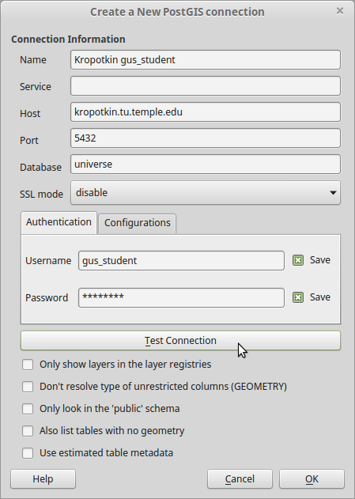

Overview
========

Data
====

The database used for this exercise is a PostGIS database available on campus only. (Instructions to connect are below). It can also be downloaded in SpatiaLite format from <https://www.dropbox.com/s/3s4j4yo0dj6ip1c/hells_kitchen.sqlite?dl=0>. However, QGIS has some problems with understanding the data type of data loaded as a QueryLayer from SpatiaLite. Additionally, some of the operations described below caused QGIS to crash when using SpatiaLite, but did not cause crashes when using PostGIS.

Hell’s Kitchen is a neighborhood in New York City west of the Midtown central business district. Although people have been trying to rebrand it as “Clinton” for at least 20 years, it is still widely known as Hell’s Kitchen. It was for a long time a neighborhood of working class Irish, and has been experiencing development pressure from the growing demand for commercial space in Midtown, as well as residential gentrifcation.

We will be using data from New York City’s “MapPLUTO”, a GIS layer of tax parcels. This data is useful for our purposes because it includes several different area measurements, including lot area (`LotArea`) and area devoted to specific uses such as residential (`ResArea`), commercial (`ComArea`), retail (`RetailArea`), etc. In order to make the analysis simpler, I have extracted parcels from MapPLUTO just for Hell’s Kitchen. I have also included ACS 2014 census tracts with race data (Table B02001, although for this exercise we will only be using the total population field `B02001e1`.)

Adding Data from a PostGIS Server
=================================

We will be working with data on Kropotkin, a PostGIS spatial database server maintained by the department containing the data for this lab exercise, a handful of ACS releases, the Natural Earth cartographic datasets, and some other Philadlephia-focused data. In QGIS, go to `Layers→Add PostGIS Layer…` or click the PostGIS (elephant head) icon  on the toolbar. The `Add PostGIS Table(s)` dialog will list previously stored connections in the top dropdown box. Since these computers may be used for other classes, you *may* see an existing connection to Kropotkin. If you do not, hit the `New` button. Set the options as follows:



-   Name = “Kropotkin” NOTE: This name is arbitrary and can really be anything you want, but in the lab you may not always use the same machine, or you may use a machine used by someone else in a different lab session, so we should use a consistent name on all the machines.
-   Host = kropotkin.tu.temple.edu
-   Port = 5432 (this should be the default)
-   Database = universe
-   Username = gus\_student
-   Password = *given in class*
-   Check “Save Username”
-   Check “Save Password”

Hit `Test Connection` to make sure you have entered everything correctly. Fix any errors, then hit `OK` to close the box. (Ignore the warning about saving passwords in plain text.)

Now you are back in the `Add PostGIS Table(s)` dialog. The new connection should be selected in the dropdown. Hit the `Connect` button to view the available spatial layers. (If you have more than one PostGIS server defined, you control which one you connect to by selecting it in the dropdown, then hitting `Connect`.)

The data is organized into several schemas. I suggest that you do *not* expand the ACS schemas, as they contain many tables and will take a while to list. The data we need for this lab is in the `lab_data` schema. Expand the tree to see the layers.

When you click on a layer name, it becomes highlighted, and will stay highlighted until you click on it again. You can select multiple layers to add to the map at once. Select the `acs2014_tract_race` layer and the `parcel` layer. Then click the `Add` button and close the dialog. You will see the layers listed in the Layers pane, and the CRS for the project should have changed to EPSG:2263 (New York State Plane New York-Long Island). If it did not (look in the lower right of the QGIS window), please change it.

<!--Add both of these tables, as well as `water_coastal` and `nyc_neighborhood` to your map.-->
Allocating Population to Tax Parcels
====================================

Our data has the population of each Census tract. However, we are interested more precisely locating the population within each tract. Fortunately, we have a property dataset, `MapPLUTO`. Since people live in residences, the parcels in the property dataset will be our **ancillary data** that we will use to distribute the population within the tracts.

Parcels are typically zoned as residential, commercial, or industrial. They may also be mixed use. The `MapPLUTO` data contains several columns indicating the square footage devoted to these and other uses: `resarea`, `comarea`, `officearea`, `retailarea`, etc. In order to allocate the population to each parcel, we need to do the following:

1.  Determine the total residential living space in each tract.
2.  Allocate the population based on the proportion of total tract residential area in each parcel.

This gives us a number of persons in each parcel. In order to map it as a choropleth, we will also have to divide by the parcel area.

Calculate the Total Residential Living Area in Each Tract
---------------------------------------------------------

Launch DB Manager in QGIS. Connect to the PostGIS Kropotkin database by expanding the item in the datasource tree in the left pane, and open the SQL window. (Refer to the previous lab exercise if you don’t remember how to do any of these steps.)

As in the previous lab exercise, we need to do an **aggregate query** using the SQL `GROUP BY` clause. We *could* do a spatial join, but attribute joins are processed faster. The `parcel` layer does not have a `geoid` field, but it does have a four-digit tract number. We will *construct* a geographic identifier that matches the `geoid` field in `acs2014_tract_race`. Enter the following text in the SQL window and Execute to view the results:

``` sql
SELECT geoid, 1.0 * sum(resarea) AS tract_resarea, , avg(b02001e1) AS tract_pop
FROM lab_data.parcel JOIN lab_data.acs2014_tract_race
  ON ('36061' || tract2010 || '00' = acs2014_tract_race.geoid)
GROUP BY geoid
```

You should see the `geoid`, along with the tract population and total residential floor area (`tract_resarea`), for each of the seven tracts.

Save this query as a view named `vw_tract_resarea`. (Again, refer to the previous lab exercise if you don’t remember how to do any of these steps.)

Calculate the Persons in Living in Each Residential Parcel
----------------------------------------------------------

Construct another query, as above. The query will have the following input tables:

-   `parcel`: Needed to determine the residential area of each parcel
-   `vw_tract_resarea`: Needed to determin the total residential area of each tract, as well as the population to allocate within the tract.

The join should be exactly the same as the query above, and no `GROUP BY` clause will be used. However, you have to calculate the persons and population density for each parcel. The `SELECT` list also needs to include a unique identifier and the geometry to map. I have stubbed out the query below:

``` sql
SELECT gid, geom, bbl,
  [expression] AS persons,
  [expression] / ST_Area(geom) AS persons_per_sqft
FROM [...]
```

When the query is running satisfactorily, load the result as a QueryLayer. Remove the tract layer. Create a choropleth using the `persons_per_sqft` column. Add a basemap using the OpenLayers plugin.
