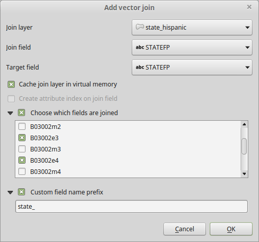
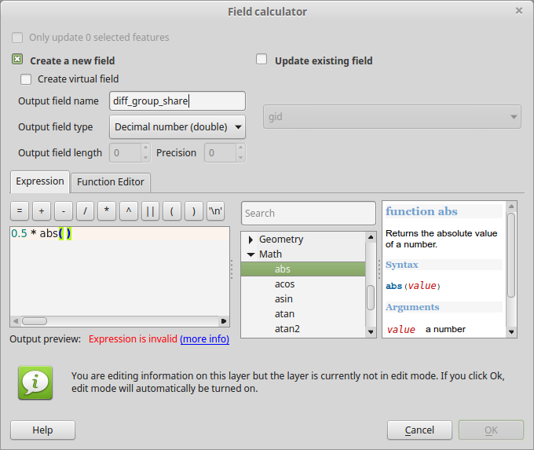

Overview
========

-   Become familiar with the Index of Dissimilarity
-   Perform a basic operation in the Processing Toolbox
-   Map a bivariate relationship

Data
====

We will work with a database of state and tract level data on race and ethnicity. I have taken the ACS subject table `B03002` and prejoined it to the state and tract geographies. I have put his in a SpatiaLite database, a type of geodatabase based on the open source SQLite database format. The source data can be downloaded from <https://www.dropbox.com/s/34fb99yva4nzyyz/acs2014_5yr_hispanic.sqlite?dl=0>. Unlike with the OpenFileGDB driver, you will be able to edit this data, including adding new fields to the attribute table.

Download the database to your flash drive or local working folder. To add the data, you first have to “Connect” to this file-based geodatabase. Go to `Layer→Add Layer→Add SpatiaLite Layer…` or click the SpatiaLite (feather) icon  on the toolbar. The dialog will list previously connected databases in the top dropdown box.

Now you are back in the `Add SpatiaLite Table(s)` dialog. The new connection should be selected in the dropdown. (When you work with this in the future, you can select any previously created database that you want to connect to.) Hit the Connect button to view the available spatial layers. This particular database has only two layers, `state_hispanic` and `tract_hispanic`, but SpatiaLite databases can contain many more. Select both layers, then click the Add button and close the dialog. You will see the layers listed in the Layers pane.

Calculating the Index of Dissimilarity
======================================

As we discussed in class, the formula for \(D\), the Index of Dissimilarity, is:

\[D = \frac{1}{2} \sum_i \left|\frac{a_i}{A} - \frac{b_i}{B} \right|\]

<!--
\ 
-->
First let’s determine what fields we will use. You may choose to calculate Black-White dissimilarity, or Hispanic-White dissimilarity. Look at the ACS metadata[1] for table B03002 “Hispanic or Latino Origin By Race”. American researchers will typically group Hispanics of all races into one category, and then the White or Black category will only count as White or Black those people who are not Hispanic. For this example, I will use `B03002e3` for Nonhispanic White and `B03002e4` for Nonhispanic Black.

QGIS gives us a way to create summary statistics using a tool called “Statistics by categories”. Looking at the formula above, we are interested in the *sum* of a calculated value. Unfortunately QGIS does not let us create summary statistics on an arbitrary expression, so first we need to create a field that represents the difference in subpopulation shares that we see to the right of the summation symbol.

Notice in the formula we need to calculate group share for each region. That is, for each tract, we need to know the share of Whites from a given state who live in that tract (represented in the formula as the fraction *ai*/*A*). Thus, we will start by joining the state layer to the tract layer on the field `STATEFP`, which contains the two-digit state FIPS code for each state.

When you perform the join, you can make things easier on yourself by only choosing the fields you are interested in:

 

Notice that I have also selected the option for a Custom field name prefix, which I have shortened from `state_hispanic_` to just `state_`.

Now we need to calculate the share for each region. In the process, we will also move the fraction ½ inside the summation.

> TIP: When you perform this calculation, QGIS will automatically turn on editing for the layer. This will slow down your grapical display, so you can speed things up by *unchecking* the Render check box in the lower right of the QGIS window.

Select the `tract_hispanic` layer in the Layers Panel. Then open the Field Calculator by clicking the icon . The default selection should be to Create a new field. (If it is not, check the box.) Set the output field name to `diff_group_share`. Output field type should be Decimal number (double). The expression will be of the form `0.5 * abs(...)`, where `abs()` is the absolute value function. Looking at the formula, try to figure out what should go inside the parentheses. You need to substitute a *field name* for each variable (*ai*, *A*, *bi*, *B*) in the expression.

 

After doing the calculation, you will notice that editing has been turned on for the layer. You can (and should) turn it off by choosing Layer→Toggle Editing from the menu, or toggling off the Edit icon . You will be prompted to save changes, and should choose Save.

Open the Processing Toolbox. This normally appears in a right-hand pane in the QGIS window. If yours is not visible, show it by selecting View→Panels→Toolbox from the menu. Then expand the following path:

-   QGIS geoalgorithms
    -   Vector table tools
        -   Statistics by categories

Set the following options:

-   Set Input vector layer to `tract_hispanic`
-   Set Field to calculate statistics on to `diff_group_share`
-   Set Field with categories to `STATEFP`

You can leave the save location as a temporary file. This will add the table to the current QGIS workspace after the calculation is complete.

When the processing tool completes, you should have a new attribute layer named `Statistics by category`. Open it to looks at the data. You will notice that you have a `category` field. This is the `STATEFP` column that you chose previously. You have several statistics columns, but the one we are interested in is the `sum` column. This value, which varies from 0 to 1, is the Index of Dissimilarity.

Now that you have calculated the Index of Dissimilarity by state, you can remove the `tract_hispanic` layer from your project.

After joining the `sum` column, QGIS may not recognize it as a quantitative value. In order to convert it to quantitative and to permanently save the value in your database, do the following:

1.  Join the `Statistics by category` table to the `state_hispanic` layer. The matching fields are `category` and `STATEFP`.
2.  Open the Field Calculator .
3.  Set the Output field name to `Dissimilarity_Black_White` or another appropriate name.
4.  Set the Output field type to “Decimal number (double).
5.  In the list of functions (middle pane), expand the Conversion branch. Select the `to_real` function and read the documentation in the right-hand pane. Double-click (or just type) to add it to the Expressions pane on the left.
6.  Finish the expression by entering the name of the column to convert. When you are done, the Expressions pane should show `to_real("sum")`.
7.  Hit OK.

Once you have created the field (confirm by opening the attribute table), you can remove the join to the `Statistics by category` layer, and you can remove the layer itself from your project.

ASSIGNMENT
==========

Create a map showing a choropleth by state of the index of dissimilarity. Superimpose a proportional symbol chart showing another variable of your choice, using the complete ACS State geodatabase from the previous lab exercise. Choose something that you think might be influenced by segregation. For example, if you have calculated Black-White segregation, you might add a proportional symbol chart showing the percentage of Blacks living in poverty. Refer to the metadata to pick an interesting variable.

In order to do this you will have to:

1.  Using a Graduated symbol, choose a sequential color scheme of 5 or 7 classes.
2.  Add a proportional symbol layer using the ACS State geodatabase.
3.  Use an appropriate projection (such as US National Atlas Equal Area).
4.  Create a layout in the Print Composer.

[1] <http://www2.census.gov/programs-surveys/acs/summary_file/2014/documentation/user_tools/ACS_5yr_Seq_Table_Number_Lookup.txt>, or documentation that you have previously downloaded
