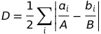

# Overview

* Become familiar with the Index of Dissimilarity
* Download data using the Census API
* Plot a bivariate relationship

# Preparation

The code for this exercise is available as a separate file: [index_of_dissimilarity.R](index_of_dissimilarity.R). Download it and execute the code chunks as you read the explanation below.

First, load all the necessary packages. We will be working with the tidycensus package, which allows us to download Census data, including spatial layers for mapping. 

```r
library(tmap)
library(tidyverse)
library(tidycensus)
library(sf)
```

You will need a Census API key to download this data. If you are working on a personally owned computer, you should previously have installed this key to your R environment, so that you don't have to load it every time. If you are working on a public computer, run the following line of code with your own Census API key. The key will remain available until you close your R (RStudio) session.

```r
census_api_key("REPLACE_WITH_YOUR_CENSUS_API_KEY") 
```

# Data

We will be working with subject table `B03002`, which contains data on Hispanic and Latino Origin By Race. This exercise will demonstrate calculating the Black/White index of dissimilarity, $D$. However the instructions also download counts for Asians and Hispanics. Hispanic origin is considered to be an "ethnicity", not a "race". We will download the variables that represent Hispanics of any race, and the variables that represent non-Hispanic persons of each race category.

```r
# Variables of interest: White, Black, Asian, Hispanic
race_vars = c("B03002_003", "B03002_004", "B03002_006", "B03002_012")
```

We then download this data for both states and tracts, as the index of dissimilarity (see below) requires data for a region (we will use states) and population units that nest with that region (we will use Census tracts). Because the ACS variable names are not very easy to work with, we will rename the variables. We will also drop the margins of error (which are included in the download), and extract the state FIPS code from the Census tract GEOID so that we can join the two tables.

We will be mapping $D$ by state, so we set `geometry = TRUE` for the state download. The default for this parameter is `FALSE`, so we leave it out for the tract download. The tract download should take several seconds. If you include the geometries, it will take quite a bit longer.

```r
sfStates = get_acs(
  geography = "state", variables = race_vars, year = 2017, 
  output = "wide", geometry = TRUE
)
sfStates = select(sfStates, state = GEOID, name = NAME, white = B03002_003E, 
       black = B03002_004E, asian = B03002_006E, hispanic = B03002_012E)
dfTracts = get_acs(
  geography = "tract", variables = race_vars, year = 2017, 
  output = "wide", state = sfStates$state
)
dfTracts = transmute(
  dfTracts, state = substr(GEOID, 1, 2), tract = GEOID, 
  name = NAME, white = B03002_003E, black = B03002_004E, asian = B03002_006E, 
  hispanic = B03002_012E
  )
```

We name the data objects `sfStates` and `dfTracts`. I use the prefix `sf` for the object that stores the state data because is a **simple features** object, a geographic format that stores the geometries (shapes) in an additional column named `geometry`. I use the `df` prefix for the object that stores the tract data because it is a **data frame**.[^This is technically untrue. It is actually a tibble. But since a tibble is a tidyverse improvement to the base R data frame, we're treating it as the same as a data frame.] Look at both objects in RStudio's built-in viewer.

# Calculating the Index of Dissimilarity

As we discussed in class, the formula for $D$, the Index of Dissimilarity, is:

$$D = \frac{1}{2} \sum_i \left|\frac{a_i}{A} - \frac{b_i}{B} \right|$$

<!--
\ 
-->

Looking at the formula above, we are interested in the *sum* of a calculated value. Working from the inside out, we need to calculate each tract's share of the region's subgroup population ($a_i/A$), subtract one share from the other, take the abolute value, add them all up by region (state), and multiply by half. The following code performs all of these steps. It does so using the `%>%` ("pipe") operator to send the result of each step to the next step.

To see how this builds up to the final value, you can evaluate each part step by step. First select line 2 (the line with the `inner_join()` function) in your code editor in RStudio, except for the `%>%` at the end. Hit `Ctl`+`Enter` to run the code and view the result. Then select line 2 and 3, again not selecting the final `%>%`. Then line 2, 3, and 4, etc., until at the end you run and evaluate the entire expression. After doing so, run the entire code block so that the results are stored in a new data frame, `dfStateD`.

```r
# Calculate the index of dissilimarity (D)
dfStateD = 
  inner_join(dfTracts, sfStates, by = "state", suffix = c("_county", "_state")) %>%
    transmute(state, x = abs(white_county / white_state - black_county / black_state)) %>%
    group_by(state) %>%
    summarise(x = sum(x)) %>%
    transmute(state, D = x / 2)
```

We now need to join this value to the states layer so that we can map it. The `inner_join()` function will perform matching based on a specified column. In this case we are using the identifer in the `state` column:

```r
sfStates = inner_join(sfStates, dfStateD, by = "state")
```

Finally, filter to only show the continental United States and make a basic map using the tmap package:

```r
# For mapping purposes, drop Alaska, Hawai'i, and Puerto Rico
sfLower48 = filter(sfStates, !state %in% c("02", "15", "72"))

# Map Index of Disimilarity
mapStateD = tm_shape(sfLower48) + 
  tm_fill(col = "D", palette = "Blues", style = "jenks", title = expression("Index of Dissimilarity")) + 
  tm_layout(title = "Index of Dissimilarity Between Black and White Population in the US", 
            title.position = c("center", "top"), inner.margins = c(0.1, 0.1, 0.15, 0.05)) + 
  tm_borders()
mapStateD

# Name and save the map
save_tmap(tm = mapStateD, filename="XXXXXXXX.png")
```

<!--
# ASSIGNMENT

Segregation is often studied not by state but by metropolitan area. Tidycensus let's us download that as well, although not the geometries. Researchers are often interested in seeing how segregation correlates with other variables. 

Determine a state-level ACS variable that you would like to compare with segregation. If you wanted to investigate the impacts of Black/White segregation, for example, you could choose median household income, unemployment, or percent poverty for Black households. Add that variable to the list of variables you will download.

Then create a variable `dfMetros`, based on the R code for `sfStates`. Set the `geography = "metropolitan statistical area/micropolitan statistical area"`, and do **not** include the geometries.

Use the `filter` function to eliminate areas that are "Micro Area"s.

After downloading the data and calculating the index of dissimilarity by metro, use ggplot to make a basic scatterplot of the two variables.
-->
