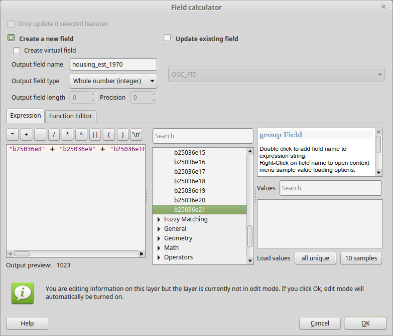

Overview
========

Because census tracts change over time, comparisons of population change can be difficult. Housing data has a year built variable that can be used to estimate where housing units were located based on current census data. More complex analyses (which will not be undertaken in this exercise) can combine housing data with population estimates to more precisely locate historical population in geographic units that are comparable across time.

This lab requires the frequent use of the Field Calculator , as well as the `Statistics by categories` geoprocessing tool. As both of these tools have been described in the exercise [Calculating the Index of Dissimilarity](Calculating%20the%20Index%20of%20Dissimilarity.md), specific instructions are not provided here.

Data
====

We will be using data from two sources, tract-level data of the year a housing structure was built from ACS table B25036 and time series of county-level counts of housing structures from NHGIS. Extracts from these data sets for the Philadelphia-Camden-Wilmington MSA have been imported into a SpatiaLite database, which can be downloaded from <https://www.dropbox.com/s/jz5jnakgssz7m6c/acs2014_philly_msa_housing.sqlite?dl=0>.

ACS Table B25036 has the following structure:

-   B25036e1 — Total:
-   B25036e2 — Owner occupied:
-   B25036e3 — Built 2010 or later
-   B25036e4 — Built 2000 to 2009
-   B25036e5 — Built 1990 to 1999
-   B25036e6 — Built 1980 to 1989
-   B25036e7 — Built 1970 to 1979
-   B25036e8 — Built 1960 to 1969
-   B25036e9 — Built 1950 to 1959
-   B25036e10 — Built 1940 to 1949
-   B25036e11 — Built 1939 or earlier
-   B25036e12 — Renter occupied:
-   B25036e13 — Built 2010 or later
-   B25036e14 — Built 2000 to 2009
-   B25036e15 — Built 1990 to 1999
-   B25036e16 — Built 1980 to 1989
-   B25036e17 — Built 1970 to 1979
-   B25036e18 — Built 1960 to 1969
-   B25036e19 — Built 1950 to 1959
-   B25036e20 — Built 1940 to 1949
-   B25036e21 — Built 1939 or earlier

Table B25036 has been joined to a spatial layer with the usual identifying columns. The spatial layer appears in the database as `acs2014_philly housing`.

The county-level data appears in table `ts_county_housing`. This table has some identifying columns, and the following data columns:

-   A41AA1970 — 1970: Housing units: Total
-   A41AA1980 — 1980: Housing units: Total
-   A41AA1990 — 1990: Housing units: Total
-   A41AA2000 — 2000: Housing units: Total
-   A41AA2010 — 2010: Housing units: Total

Add both of these tables to QGIS. Go to `Layer→Add Layer→Add SpatiaLite Layer…` or click the SpatiaLite (feather) icon  on the toolbar. The dialog will list previously connected databases in the top dropdown box. As you have not connected to this database previously, click the New button, and navigate to `acs2014_philly_msa_housing.sqlite`. Hit Open, then hit Connect.

You will see the spatial layer `acs2014_philly_housing`. Select it and hit Add.

Now open the Add SpatiaLite Layer dialog again. Table `ts_county_housing` did not appear in the list because it is not a spatial layer. Click the check box at the bottom for “Also list tables with no geometry”. Then select `ts_county_housing` from the list and hit Add.

Calculating Tract-Level Housing
===============================

Estimating Tract-Level Housing Based on Year Structure Built
------------------------------------------------------------

ACS Table B25036 contains columns indicating the year that a residential structure was built. Therefore, we can estimate the number of housing units existing in a particular census year, by adding the columns for structures built in each of the preceding decades. Since the columns are split into owner occupied and renter occupied units, we have to add both of these together.

We will be creating maps going back to 1970, the earliest year for which we have county-level totals. To calculate the number of structures existing in 1970, we need to add the categories `Built 1939 or earlier`, `Build 1940 to 1949`, `Built 1950 to 1959`, and `Built 1960 to 1969`, for both owner and occupied unites.

Using the Field Calculator , create a new field in table `acs2014_philly_housing` named `housing_est_1970`, of type “Decimal number (double)”.

> **TIP:** In order to be able to be able to use the `Statistics by categories` geoprocessing tool, this field *must* use a decimal number type, even though the data are all integer values.

In the Expression editor, enter the following formula `"b25036e8"  +  "b25036e9"  +  "b25036e10"  +  "b25036e11"  +  "b25036e18"  +  "b25036e19"  +  "b25036e20"  +  "b25036e21"`. You can cut and paste this, or enter it manually, or use the fields and functions from the middle pane.

 

Editing will be turned on for the layer. Make sure to save  your edits periodically.

> **TIP:** Keep in mind that saving edits to the *layer* is not the same as saving your QGIS map! When you add columns to the layer, you save changes to the data source, which in this case is the SpatiaLite file `acs2014_philly_msa_housing.sqlite`. When you save changes to your map, you are saving a file with a `*.qgs` extension, such as `Lab4.qgs`.

Now that you have done that for 1970, creating housing estimate columns for 1980, 1990, 2000, and 2010. In each case, remember that the estimate should only include housing built up to the *prior* decade. For 2010, only add columns up to `Built 2000 to 2009`. Do ***not*** include `Built 2010 or later`.

> **TIP:** Toggle editing off  each time you add a new column. It appears that changing the table structure confuses QGIS’s data connection, and adding two or more fields will look like it is working, but the field will disappear when the project is closed. After toggling editing off, refresh  the table to make sure the new data is really there.

Note that when constructing later year estimates, you can make things easier by using your previously calculated columns. For example, when calculating the housing estimate for 1980, instead of adding every decade, you can just add the housing built in the 1970s to your previously calculated `housing_est_1970`. However, make sure to toggle off editing in between creating new fields, as discussed in the previous tip.

Adjusting Tract-Level Housing Estimate Based on County-Level Totals
-------------------------------------------------------------------

Housing units from previous decades may have been demolished, in which case they won’t appear in the current ACS data. On the other hand, units from previous decades may have been subdivided. Therefore, relying just on the year built data can lead to either an undercount or overcount of housing units from previous decades.

A simple way to adjust the count, is to use the county-level housing counts from previous censuses, and adjust the tract-level count proportionally. The estimates calculated in the previous step are aggregated to the county level and compared to the official county-level housing unit count. If the aggregated estimates show 100,000 housing units in 1980 and the official county count is 110,000, then each tract estimate is multiplied by 1.1 (110,000/100,000).

In order to calculate the aggregate housing by county, as well as in order to join these two tables, we need a single join column that uniquely identifies each county. This filed must combine the values from `STATEFP`, which is the two-digit state FIPS code, and `COUNTYFP`, which is the three-digit county FIPS code, into a unique five-digit identifier. Therefore in *both* tables, use the Field Calculator  to create a new field of type “Text” named `county_fips5`. Set it equal to `"STATEFP" || "COUNTYFP"`. (The double-pipe `||` is the string concatenation symbol.)

Make sure to Save Edits  for both layers.

### Calculating County-Level Estimate Based on Year Structure Built

We now have tract-level estimates of housing units based on the year a structure was built. We can now calculate an estimate of the county-level housing units by aggregating the tract-level estimates. Open the `Statistics by categories` tool from the Processing Toolbox.

Your project only has one spatial layer, so Input vector layer should display `acs2014_philly_housing`. Set the following parameters:

-   Field to calculate statistics on = `housing_est_1970`
-   Field with categories = `county_fips5`

Leave the file box as “\[Save to temporary file\] and hit run. You should now have a layer named `Statistics by category`. This table has a field named `sum`, which is the field we are interested in. The following steps are ones that you have completed in previous exercises, and therefore are not described further:

1.  Join `acs2014_philly_housing` to `Statistics by category`
    -   Join field = `category`
    -   Target field = `county_fips5`

2.  Create a new field in `acs2014_philly_housing` using the Field Calculator 
    -   Output field name = `county_est_1970`
    -   Output field type = “Decimal number (double)”
    -   Expression: `to_real(sum)` **NOTE:** If you adjust the join table prefix in the previous step, make sure to use the appropriate name in place of `sum`!

3.  Save edits  and Toggle editing off 
4.  Remove the join to `Statistics by category`
5.  Remove the `Statistics by category` layer from your project.

Once you have done this for 1970, repeat it for 1980, 1990, 2000, and 2010.

### Applying Proportional Adjustment to Tract-Level Estimates

For the final step, we need to adjust the tract-level estimate based on the county-level undercount or overcount. Begin by joining `acs2014_philly_housing` to `ts_county_housing`. Remember that both tables have a matching `county_fips5` field.

Now open the attribute table for `acs2014_philly_housing`, and open the Field Calculator . Create a new field with the following parameters:

-   Output field name = `housing_adj_1970`
-   Output field type = “Decimal number (double)\`
-   Expression: `"housing_est_1970" * "A41AA1970" / "county_est_1970"`

Hit OK. Save edits and Toggle editing off. Then repeat for 1980, 1990, 2000, and 2010. Make sure to Save edits after each field calculation.

ASSIGNMENT
==========

Create a map showing the change between two time periods of your choice. For a choropleth map, choose a Graduated style. Set the column to an expression that converts the growth to a percentage. For example, to show growth between 1970 and 1990, you would use the following expression (which you can build using the expression editor :

`100 * ("housing_adj_1990" - "housing_adj_1970") / "housing_adj_1970"` 

You can experiment with other types of map, if you would rather not create a choropleth map.

Make sure that your map includes the usual layout elements, like a title, legend, etc. The map coordinate system should change to EPSG:2272 (Pennsyslvania State Plane South) when you add the data, but make sure that this is what it is before laying out your map.
