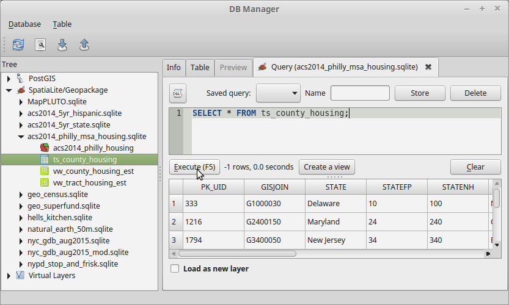
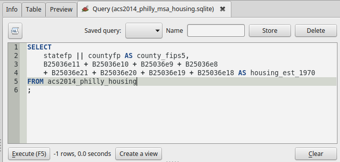
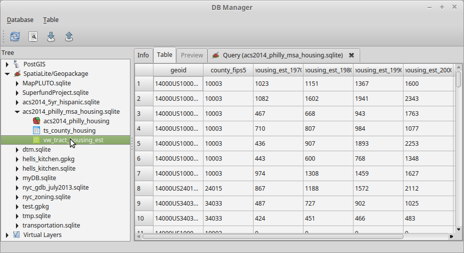
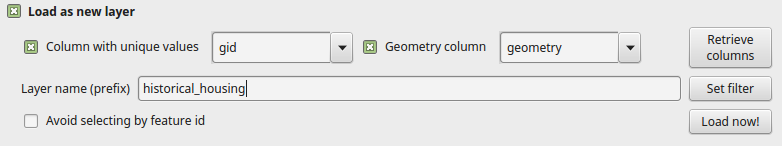

Overview
========

**The purpose of this lab is to introduce you to basic SQL querying for population analysis. The analytical method and dataset are repeated from a previous exercise. The purpose of essentially repeating this analysis is to allow you to work with data you are already familiar with while you get comfortable with a new way of interacting with the data.**

Because census tracts change over time, comparisons of population change can be difficult. Housing data has a year built variable that can be used to estimate where housing units were located based on current census data. More complex analyses (which will not be undertaken in this exercise) can combine housing data with population estimates to more precisely locate historical population in geographic units that are comparable across time.

Data
====

We will be using data from two sources, tract-level data of the year a housing structure was built from ACS table B25036 and time series of county-level counts of housing structures from NHGIS. Extracts from these data sets for the Philadelphia-Camden-Wilmington MSA have been imported into a SpatiaLite database, which can be downloaded from <https://www.dropbox.com/s/jz5jnakgssz7m6c/acs2014_philly_msa_housing.sqlite?dl=0>. **NOTE: You can reuse the previously downloaded data, even though you have made some changes to the tables.**

ACS Table B25036 has the following structure:

-   B25036e1 — Total:
-   B25036e2 — Owner occupied:
-   B25036e3 — Built 2010 or later
-   B25036e4 — Built 2000 to 2009
-   B25036e5 — Built 1990 to 1999
-   B25036e6 — Built 1980 to 1989
-   B25036e7 — Built 1970 to 1979
-   B25036e8 — Built 1960 to 1969
-   B25036e9 — Built 1950 to 1959
-   B25036e10 — Built 1940 to 1949
-   B25036e11 — Built 1939 or earlier
-   B25036e12 — Renter occupied:
-   B25036e13 — Built 2010 or later
-   B25036e14 — Built 2000 to 2009
-   B25036e15 — Built 1990 to 1999
-   B25036e16 — Built 1980 to 1989
-   B25036e17 — Built 1970 to 1979
-   B25036e18 — Built 1960 to 1969
-   B25036e19 — Built 1950 to 1959
-   B25036e20 — Built 1940 to 1949
-   B25036e21 — Built 1939 or earlier

Table B25036 has been joined to a spatial layer with the usual identifying columns, such as `geoid`, `statefp` (for the two-digit State FIPS code), etc. The spatial layer appears in the database as `acs2014_philly housing`.

The county-level data appears in table `ts_county_housing`. This table has some identifying columns, and the following data columns:

-   A41AA1970 — 1970: Housing units: Total
-   A41AA1980 — 1980: Housing units: Total
-   A41AA1990 — 1990: Housing units: Total
-   A41AA2000 — 2000: Housing units: Total
-   A41AA2010 — 2010: Housing units: Total

Make sure that you have a connection to the SpatiaLite data. Go to `Layer→Add Layer→Add SpatiaLite Layer…` or click the SpatiaLite (feather) icon  on the toolbar. The dialog will list previously connected databases in the top dropdown box. If you have connected to this database previously, it will appear in this list, and you can close this dialog box.

If `acs2014_philly_msa_housing.sqlite` is not in the list, click the New button, and navigate to the file. Hit Open, then hit Connect. You will see the spatial layer `acs2014_philly_housing`. Close the dialog box without adding anything.

Using DB Manager
================

QGIS has a built-in database manager that can be used to examine and manage SpatiaLite (and other) spatial database sources. To open it, select Database-&gt;DB Manager-&gt;DB Manager from the menu, or click the DB Manager icon  on the toolbar.

Once in DB Manager, you can expand the SpatiaLite/Geopackage branch to view registered SpatiaLite databases. Since you just confirmed (or created) a connection to `acs2014_philly_msa_housing.sqlite`, you should see it in the list. Click the Info and Table tabs for both layers, and the Preview tab for the spatial layer.

We are going to be doing our calculations using SQL, a programming language for database querying. To open the SQL window, do one of the following:

-   Select the SQL window toolbar button 
-   Go to the Database-&gt;SQL menu
-   `F2` on the keyboard

The simplest query just returns all rows and columns from a table. Type (**DO NOT CUT AND PASTE**) the following code into the SQL window:

``` sql
SELECT * FROM ts_county_housing
```

As you start typing `ts_county_housing`, a popup will autocomplete the table name for you. Select the name from the list and then hit the Execute button, just under the SQL window. The result will display all tables and rows in the indicated table:



You can choose to display only certain columns of your data. Make sure that each item in the `SELECT` list is separated by a comma from the previous item. Copy and paste the following (replacing the old query) into the SQL window and Execute:

``` sql
SELECT county, state, a41aa2010 FROM ts_county_housing
```

You should now see the county and state names and the 2010 housing count.

You can also apply a filter to your results using the `WHERE` clause. Leave the previous query and *add* the following *after* the existing code:

``` sql
WHERE state = 'Pennsylvania'
```

You should now see only counties in Pennsylvania. You can also use `%` as a **wild card** to match any number of characters. In this case, you have to replace `=` with the `LIKE` operator:

``` sql
WHERE state LIKE 'Penn%'
```

This should produce the same result as before.

Now try to construct a `WHERE` clause that tests field `a41aa2010` and returns only counties with fewer than 50,000 people. (Keep in mind that in code, numbers should be entered without thousands separators.)

Although the SQL window does let you save your query code, it cannot be accessed outside of QGIS or easily shared. Therefore, you should open a text editor (such as Notepad++ on Windows) to save your query. As you work on building your queries in the following steps, you can periodically copy the query text from the SQL window and paste it into the text editor. Make sure to save your work periodically as well. At the end of this assignment you will turn in your text file with the SQL code you have created.

Calculating Tract-Level Housing
===============================

Estimating Tract-Level Housing Based on Year Structure Built
------------------------------------------------------------

ACS Table B25036 contains columns indicating the year that a residential structure was built. Therefore, we can estimate the number of housing units existing in a particular census year, by adding the columns for structures built in each of the preceding decades. Since the columns are split into owner occupied and renter occupied units, we have to add both of these together.

1970 is the earliest year for which we have county-level totals. To calculate the number of structures existing in 1970, we need to add the categories `Built 1939 or earlier`, `Built 1940 to 1949`, `Built 1950 to 1959`, and `Built 1960 to 1969`, for both owner and occupied unites.

As identifiers we will include the `geoid` and a five digit county FIPS code constructed from the `statefp` and `countyfp` fields. (We will use this later to join to the `ts_county_housing` table.) Paste the following code into the SQL window (replace your previous query):

``` sql
SELECT
    geoid, statefp || countyfp AS county_fips5,
    B25036e11 + B25036e10 + B25036e9 + B25036e8 + B25036e21 + B25036e20 + B25036e19 + B25036e18 AS housing_est_1970
FROM acs2014_philly_housing
;
```

Your SQL window should look similar to this:



Hit Execute to view the result. Note that the query outputs a `housing_est_1970` field which is the sum of 8 input fields.

Now edit the query to calculate columns representing the estimated housing in 1980 (`housing_est_1980`), 1990, 2000, and 2010. In each case you will have to duplicate the input fields from the previous decade, and add two new fields. In each case, remember that the estimate should only include housing built up to the *prior* decade. For 1980, you will have to add `B25036e7` (representing owner-occupied housing built in the 1970s) and `B25036e17` (representing renter-occupied housing built in the 1970s). At the end of the sum of columns, use `AS housing_est_1980` to **alias** (rename) the output column.

Make sure to include a comma before each new element in the `SELECT` list.

When your query is executing correctly and outputing a column for each decade from 1970 to 2010, copy your code to your text editor and save your work. This will be submitted at the end.

We are now going to save this set of instructions in the database as a **view**. A view functions like a table, but stores instructions for manipulating the data (as we have done), rather than an actual copy of the data. Hit the Create a view button just under the SQL window. In the dialgo box, enter the name `vw_tract_housing_est`. We will use the prefix `vw_` in front of all of our views, in order to quickly distinguish them from tables. Hit OK.

Click on the database name `acs2014_philly_msa_housing.sqlite` in the tree in the left pane, and hit the Refresh toolbar button. The view will now appear in the list. Select the view and select the Info tab in the right pane. You will see the query that was used to create this view (the code you just entered). Now hit the Table tab. SpatiaLite will execute the query and display the results as a table:



Adjusting Tract-Level Housing Estimate Based on County-Level Totals
-------------------------------------------------------------------

Housing units from previous decades may have been demolished, in which case they won’t appear in the current ACS data. On the other hand, units from previous decades may have been subdivided. Therefore, relying just on the year built data can lead to either an undercount or overcount of housing units from previous decades.

A simple way to adjust the count, is to use the county-level housing counts from previous censuses, and adjust the tract-level count proportionally. The estimates calculated in the previous step are aggregated to the county level and compared to the official county-level housing unit count. If the aggregated estimates show 100,000 housing units in 1980 and the official county count is 110,000, then each tract estimate is multiplied by 1.1 (110,000/100,000).

### Calculating County-Level Estimate Based on Year Structure Built

We now have tract-level estimates of housing units based on the year a structure was built. We can now calculate an estimate of the county-level housing units by aggregating the tract-level estimates.

In order to do this, we are going to create a SQL **aggregate query**. This functions the same as Summarize in ArcGIS, or Statistics By Category in QGIS. It finds all values associated with the same category, and performs an aggregate operation, such as summation, averaging, counting, etc.

Paste the following code into the SQL window:

``` sql
SELECT
    county_fips5, sum(housing_est_1970) AS county_est_1970, sum(housing_est_1980) AS county_est_1980, sum(housing_est_1990) AS county_est_1990, sum(housing_est_2000) AS county_est_2000, sum(housing_est_2010) AS county_est_2010
FROM vw_tract_housing_est
GROUP BY county_fips5
;
```

Hit Execute to view the output. This SQL statement tells the database to find all rows with matching county identifiers (`GROUP BY county_fip5`) and add (`sum`) specific columns. It also aliases the results.

As in the previous step, we are going to create view so that we can easily refer to this result. Hit the button to Create a view and name it `vw_county_housing_est`. Then refresh the tree view (left pane) so that you can see it has been added.

### Applying Proportional Adjustment to Tract-Level Estimates

For the final step, we need to adjust the tract-level estimate based on the county-level undercount or overcount. Begin by joining `acs2014_philly_housing` to `ts_county_housing`. We created both views with a matching `county_fips5` field.

The beginning of the query is as follows:

``` sql

SELECT
    gid, geoid, geometry, 1.0 * housing_est_1970 * A41AA1970 / county_est_1970 AS housing_adj_1970
FROM acs2014_philly_housing
    JOIN vw_tract_housing_est USING (geoid)
    JOIN vw_county_housing_est USING (county_fips5)
    JOIN ts_county_housing USING (statefp, countyfp)
;
```

The various `JOIN` clauses at the end, do the same thing as a join in ArcGIS or QGIS, but much more easily. In each case, we specify the matching columns that will be used to join the tables. For example, `USING (geoid)` is used to join the spatial layer `acs2014_philly_housing` to the view with the tract-level housing estimates by decade, `vw_tract_housing_est`.

The expression `1.0 * housing_est_1970 * A41AA1970 / county_est_1970 AS housing_adj_1970` multiplies the 1970 tract-level housing estimate by the 1970 county-level housing count, and divides it by the 1970 county-level housing estimate. (Multiplying by 1.0 is a trick to force SpatiaLite to perform decimal division as opposed to integer division.)

Execute this query to see the result.

Now edit the query to add additional columns for 1980 (`housing_adj_1980`), 1990, 2000, and 2010. Paste your code periodically into your text editor. When the query is complete, save your final result. You will submit this code at the end.

Adding a Spatial Query Layer to the Map
=======================================

Your query is now complete! Even though this data table is being constructed “on the fly”, this layer can be added to QGIS. Since we have included the `geometry` column, it can also be mapped! At the bottom of the SQL window, check Load as new layer. Several new options will appear:



Make sure that “Column with unique values” is set to `gid` and “Geometry column” is set to `geometry`. You may optionally assign a name to the layer, which is the name that will appear in the QGIS Layers Panel. I have chosen `historical_housing`. When you are done, the hit Load now! button.

ASSIGNMENT
==========

Create a map showing the change between two time periods of your choice. For a choropleth map, choose a Graduated style. Set the column to an expression that converts the growth to a percentage. For example, to show growth between 1970 and 1990, you would use the following expression (which you can build using the expression editor :

    100 * ("housing_adj_1990" - "housing_adj_1970") / "housing_adj_1970"

Due to a bug in the way QGIS and SpatiaLite interact, QGIS may not recognize these columns as numeric. If you find that to be the case, wrap each field name in the `to_real()` function.

During class, Prof. Hachadoorian will demonstrate how you can add a web layer as a basemap for your project.

Make sure that your map includes the usual layout elements, like a title, legend, etc.
