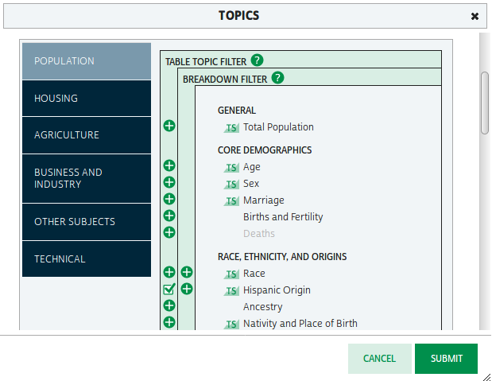

Overview
========

-   Become familiar with the QGIS interface.
-   Become familiar with American Community Survey Data.
-   Become familiar with and download data from National Historical GIS website.
-   Create a basic thematic map in QGIS.

Downloading Data from NHGIS
===========================

American Community Survey data are available from a wide variety of US Census Bureau and value-added sources such as the USCB's FTP server, American Fact Finder, National Historical GIS, and Social Explorer. Census data has two important parts: geographies (spatial layers) and demographic tables (attribute tables).

Go to the NHGIS user's guide at <https://www.nhgis.org/user-resources/users-guide> and watch the first video tutorial, "NHGIS Data Finder (general overview)". After watching the video return to the NHGIS website.

> You will have to create an account with IPUMS to download data. You may do that at this point (click the LOGIN link, then follow the link to create a new account), or you will be prompted to do so automatically when you attempt to create a data extract.

Click the Select Data link in the left-hand menu. On the Apply Filters page, there are four filters to set, although we will set only three. Begin by setting Geographic Levels to State, and then set Years to 2015. Each time, hit the Submit button to apply the filter. The list of available data at the bottom of the page (Select Data) will update as you apply these filters.

For this tutorial I am going use data on race and Hispanic origin. For the ACS, this is table B03002. Select the Topics filter. Find "Hispanic Origin" in the list of topics. There are two green plus signs to the left. Click the left one. (As you can see, the right plus sign appears in a column labelled "BREAKDOWN FILTER". We will discuss what this means in a future class.) The image should turn into a checkbox:

 

Then hit Apply.

The subject table that we are interested in, B03002, should appear near the top of the list of "Source Tables" in the Select Data grid. As this subject table is widely used by researchers, the popularity meter in the second column should be full or nearly full. Hit the green plus sign to add this subject table to your Data Cart (note that the Data Cart updates in the upper right of the web page).

> **Advanced:** You may use this year and topic to follow along, or you may pick another topic. If you make your own selection, you will have to create your own CSV Template file in the next section. Pick something that represents a breakdown of total population or housing. For example, you could choose sex, employment, housing occupancy, etc, which break into categories, such as male and female, or renter/owner/vacant. Do not *only* pick a statistical aggregate, such as median age or median income.

The Select Data grid has two more tabs: "TIME SERIES", which we will not be using, and "GIS BOUNDARY FILES", which you should select. Based on our state and year filters, you should see only one available GIS Boundary File, which you should add to the Data Cart.

In the Data Cart (upper right), hit CONTINUE, review your selections and hit CONTINUE again. On the Review and Submit page, you may choose to add a Description to your extract. The remaining defaults should be OK, and you can hit SUBMIT to begin your extract.

You will be taken to the Extracts History page. You will need to follow two links to download your tables (in the Download Table Data column) and your boundary files (in the Download GIS Data column). These links may not immediately appear. You will get an email when the downloads are ready, but you can also just refresh the page after a few seconds (`Ctrl`+`R`) to see if the links are available. For an extract of this size, it shouldn't take more than 30 seconds or so.

When you click the download links, depending on your web browser settings, you may be prompted for a location to save the file, or your browser may automatically save it to your Downloads folder. Save it or copy it to a folder where you will store all your data for this course. If you are working on a lab computer, I highly recommend that you save all your data and all your work to your flash drive.

In each case you will end up with ZIP files containing the downloaded data. Unzip the files using 7-Zip or your computer's ZIP utility. In many operating systems this can be accomplished by right-clicking the ZIP file in the file manager (Finder on Mac, Windows Explorer on Windows) and choosing "Extract Here" or a similar option. You can also double-click to open the archive, then drag-and-drop the enclosed files to your desired location. For the geographic files, **you will download a ZIP within a ZIP**, so make sure to completely unnest the data. I would suggest flattening the folder hierarchy (your files may unzip to separate CSV and GIS folders, but combine them into one folder) so that all your data files are in a single folder, and deleting the downloaded ZIP files.

The geographic data should have a reasonably informative name (in the example, I end up with `US_State_2015.shp` and associated files). The attribute data, however, gets a silly name that is partially based on how many NHGIS downloads you have done in the past (I end up with `nhgis0024_ds215_20155_2015_state.csv`). I suggest renaming the files. You have two reasonable choices:

-   Conform to the ACS table name: `B03002_state_2015.csv`
-   Give it a descriptive name: `Hispanic Origin by Race - State 2015.csv`

Later in the course you may want to work with smaller geography data such as Census Tracts. Since this will contain geographies and data for many more units (currently there are approximately 74,000 census tracts in the US), the extract will be somewhat slower to create and the downloaded files will be larger.

Working with ACS Data in QGIS
=============================

Preparing a CSV Template File
-----------------------------

The attribute data that we downloaded from NHGIS is in a CSV (comma-separated values) text file. Because the file uses text, QGIS needs a hint in order to correctly recognize numeric data. We do this by creating a CSVT (for "CSV Template") file which contains a list of data types. You may use the data types String, Real (meaning decimal data), Integer, Time, and DateTime. [1]

If you downloaded data for B03002, follow these steps to create the CSVT file:

1.  Open a text editor, such Notepad++.
2.  Copy this line of text: `String,String,String,String,String,String,String,String,String,String,String,String,String,String,String,String,String,String,String,String,String,String,String,String,String,String,String,String,String,String,String,String,String,String,String,String,Real,Real,Real,Real,Real,Real,Real,Real,Real,Real,Real,Real,Real,Real,Real,Real,Real,Real,Real,Real,Real,String,Real,Real,Real,Real,Real,Real,Real,Real,Real,Real,Real,Real,Real,Real,Real,Real,Real,Real,Real,Real,Real`
3.  Paste the text into the text editor.
4.  Save the file using the same basename as the CSV, but with the extension CSVT. For example, if you named the file you downloaded `B03002_state_2015.csv`, you want your new, CSV Template file to be named `B03002_state_2015.csvt`.
5.  Close the text editor.

If you downloaded a different subject table, you will also have to make your own CSVT header. Look in the codebook file for a complete list of column names. You will notice that the codebook has a lot of information about the data, as well as a list of column names grouped into "Context Fields", "Estimates", and "Margins of Error". You need to have one Data Type for each field name. All of the Context Fields, as well as the fields `NAME_E` and `NAME_M` should be set as `String`. All of the other fields represent quantitative data and should be set as `Real` (for "real number").

Depending on what subject table you download, you may have many field data types to set. In class, the instructor can show you how to quickly accomplish this using spreadsheet software.

Adding Data in QGIS
-------------------

Open QGIS Desktop (*not* QGIS Browser) by double-clicking the icon on your desktop, or find it in the Start Menu in the OSGeo4W folder.

 

The central pane is where you will see the geographic data that you add. The left and right panes are dockable panels that can be torn off (grab the title bar of the panel) if you prefer floating panels in your workspace. We won't be using the Processing Toolbox today, so if it is open (by default in a right-hand panel) you can close it in order to increase the area avaialable for the map canvas. The left panel is the Layers pane. This will be an index of layers you have added.

Now let's add some data. QGIS allows you to pretty easily add file-based spatial data (such as shapefiles) as well as data from web map services (WMS, WCS, WFS) and spatial databases (such as PostGIS). As with many software, there are multiple ways to accomplish the same thing. I find that the easiest way to add data is to drag and drop from the Browser Panel on the left. Navigate to your unzipped data files, and drag the states shapefile (`US_state_2015.shp`, or whatever you downloaded) to the map canvas. The state layer should appear. Then drag the CSV file (which I suggested you store in the same folder as the shapefile) to the map canvas. Because this file lacks geographic data, nothing should change. Switch back to the Layers Panel in the left-hand pane.

Although we haven't done much yet, it is a good idea to save your work early and often. Hit `Ctrl+S` to save your QGIS document. Make sure to save it to your flash drive or other working folder. As you continue to work, periodically hit `Ctrl`+`S`, especially after making any signficant changes to your map.

Joining a Spatial Layer to Attribute Data in QGIS
-------------------------------------------------

In order to map the demographic data, we need to join it to the spatial layer. Double-click the `US_states_2015` layer in the Layers Panel. In the left column, choose the Joins tab. At the bottom of the window hit the Green plus sign to open the Add vector join dialog. Choose a Join layer. (Since we are only using one attribute table in this exercise, the correct table should be selected.) Then choose `GISJOIN` as both the Join field (matching field in the Join layer) and Target field (matching field in the base table, which is usually your spatial layer).

When the table gets joined, the fields will appear in the `US_state_2015` attribute table. The joined fields will be prefixed with the table name of the join layer, which may be long and make it difficult to see the field names in the attribute table. Click the checkbox for a Custom field name prefix, and shorten the prefix to `race_`.

After setting these parameters, your dialog should look like this:

 

Hit OK. Then hit OK again to close the Layer Properties dialog.

The `US_state_2015` layer should still be selected in the Layers Panel. (If it is not, single-click to select it.) Hit the Open Attribute Table toolbar button , or right-click the layer and select Open Attribute Table from the popup menu. Scroll to the right of the table grid to see the new columns that have been joined.

Cartographic Display of Demographic Data
========================================

Create a Choropleth Map
-----------------------

A **choropleth** map is a map that colors the geographic entity (states in this tutorial) based on the value of underlying attribute data. Choropleths should virtually never be used to represent raw count data! They should be used for densities (population per unit area), rates (cases or incidents, such as a disease or crime, per population), or proportions (such as percent of the population in a racial or ethnic group). Let's make a map of the percent of the population in each state which is African-American.

Open the Layer Properties dialog and select the Style tab in the left pane. At the top, the symbol type for a new layer is set to a default of Single Symbol.

1.  Click the dropdown that says "Single Symbol" and change it to "Graduated", which is appropriate for numeric data.
2.  In the Column box, you can use the dropdown to select a column name, type in an expression, or click the Expression Editor button . The field representing "Not Hispanic or Latino: Black or African American alone" is `ADK5E004`. The field representing "Total Population" is `ADK5E001`. Therefore, you can show the percentage African American by typing the following formula into the box: `100 * race_ADK5E004 / race_ADK5E001`.
3.  Select a **sequential** color ramp from the Color ramp dropdown. A sequential color ramp is one that progresses from light to dark. A **diverging** color ramp is light in the middle but progresses to two different hues (e.g. blue and bronw) at the extremes.
4.  In the Mode dropdown, choose "Natural Breaks (Jenks)".
5.  Set the number of classes to either 5 or 7.
6.  The appropriate number of classes, with varying color symbols, should appear in the central pane of the dialog box. If it does not appear (i.e., the central pane is blank), click the Classify button just above it.
7.  Hit OK to see your map.

Create a Proportional Symbol Pie Chart Map
------------------------------------------

Magnitude data, like counts, can be represented using a so-called **proportional symbol map**, where a symbol such as a circle is sized relative to the underlying data values. (Sometimes, usually by non-geographers, this is referred to as a bubble map or bubble chart.) For data that adds up to a total, we may display the result using a pie chart. The pie chart size is controlled by total population, and the pie chart itself shows the components of the total. For example, for housing, you could display a pie chart with wedges showing renter-occupied, owner-occupied, and vacant housing. We will display a pie chart showing wedges based on the count of population of a given race. (For the present exercise, we will ignore the categories "Some other race" and "Two or more races".)

To add the pie charts, open the Layer Properties dialog and click the Diagrams tab in the left-hand pane. Then check the box "Show diagrams for this layer" at the top of the dialog. The Diagram type should default to Pie chart, but if it doesn't select it from the dropdown.

There are five settings groupings: Attributes, Appearance, Size, Placement, and Options. We will make changes in three of them:

-   Attributes: Look in the codebook to determine which fields represent which attributes. Select the fields for the following categories, and click the green plus sign so that they appear in the Assigned attributes pane:
    -   Not Hispanic or Latino: White alone
    -   Not Hispanic or Latino: Black or African American alone
    -   Not Hispanic or Latino: American Indian and Alaska Native alone
    -   Not Hispanic or Latino: Asian alone
    -   Not Hispanic or Latino: Native Hawaiian and Other Pacific Islander alone
    -   Hispanic or Latino (all races)
-   Size: Click the Scaled size radio button
    -   Attribute: Set to `race_ADK5E001`, which is the total population of all races
    -   Maximum value: Click the Find button to determine the largest value in the selected field, `race_ADK5E001`. **NOTE: As of QGIS 2.14.3, this appears not to work with joined data. Therefore, you may have to exit this dialog and inspect the attribute table yourself to find the largest value. You can do this by clicking on the top of the `race_ADK5E001` column to sort the data in that column.**
    -   Size: This number represents the Area (default) or Diameter of pie chart. For magnitude data, you always want this to be the Area. The default is 50. Depending on your map, this symbols may be too large or too smale. For this data at this scale, I would suggest experimenting with values between about 15 and 30. (See image below.)
-   Placement: Set the Placement dropdown to Over Centroid

 

Click OK to close the dialog.

Note that the Pie Chart is also what you would use to set a proportional symbol for a single magnitude value, like total population. Just choose a single value in the Attributes panel and choose the same attribute to control the size in the Size panel.

Creating a Print Layout
=======================

Setting up the Layout
---------------------

In order to create a print layout, we set it up in a separate window called the Print Composer. Choose `Project→New Print Composer`. A window will open up that, as with desktop publishing software, looks like a piece of paper on a pasteboard. Before adding any elements, let's set up the window to make it easy to work with visually. In the View menu, select the options to `Show Grid` and `Snap to Grid`. In the lower right, you will see a panel with three tabs: Composition, Item Properties, and Atlas Generation. Choose the Composition tab. Under `Paper and quality`, choose the preset for "ANSI A (Letter; 8.5x11 in)". The set the grid spacing to 4.23 mm. (This is roughly equal to 1/6", which in desktop publishing is known as a **pica**.)

Adding the Map
--------------

Now we will add the main map. Click the `Add new map` button . Place your map on the page by clicking and dragging over the area that you want the image to fill. Draw the map to cover most of the page. Leave room for a title at top, and a legend to the right. *The snap-to-guides feature will not be in effect while tracing the dimensions of new layout item,* so after you draw it, drag it so that it snaps to the upper-left corner of the layout, then grab the lower-right corner and drag it so that it snaps to the desired position. The Median Income layer and the OpenStreetMaps layer should be visible.

At this point you may want to adjust the viewable area of your map. Click the `Move item content` button . You can now click within the map frame to reposition it. You can use the scroll wheel on your mouse to move in and out (although the zoom steps may be somewhat gross). There is no click-and-drag zoom tool (the magnifiying glass), but you can switch back to the main QGIS window, zoom to desired level, then switch back to the Print Composer and hit the Refresh button. It's very hard to give precise instructions about how to do this--just play around with the tools. You want the metropolitan area to fill the area of the main map.

Adding Supporting Elements to the Page
--------------------------------------

Now add a title using the `Add new label` tool .[2] Select the tool and click in the map in the top left of the page. The label will immediately appear with some dummy text. Position it in the upper left corner, and drag the lower right corner to fill an area roughly 3 picas tall and stretching across the top of the page. In the Item Properties tab, change the label text to an appropriate title for your map. Click the Font button, and set the font to Arial Black[3] 24. Set the Alignment to Horizontal=Center and Vertical=Bottom. If the title is long enough to wrap to a second line, make the font size smaller.

Click the `Add new legend` tool  and drop a legend in the empty area to the right. The legend will appear with entries for *all* layers in your map. If you're only interested in a particular layer, in the Item Properties tab, expand the Legend items section, select and delete (using the large red minus icon) any layers you don't want to appear in the legend. Below the legend, add sources and any additional information you want, including your name. Depending upon the steps taken for a particular map, you may credit yourself for "Cartography" or for "Analysis and Cartography". For this map, just "Cartography" is appropriate. The data are from the American Community Survey 2014 5-year Average. Date your work. Add any other explanatory text or credits that you want. You may add a scale bar and North arrow, but for thematic maps (as opposed to reference maps) these elements are not strictly necessary, and can just clutter your layout.

Exporting the Image
-------------------

You can export your map to several formats. There are three options: PDF, SVG, and Image. PDF is a good format for maps intended to be printed. SVG stands for Scalable Vector Graphics, and is theoretically a good format for much digitial imagery, but the SVG export option in QGIS is buggy, so you should avoid it for now. Choosing `Export as Image` actually gives the option of a wide variety of image formats, including PNG which is a good choice for web images.

DELIVERABLES
============

Export two PNG images of your map. One with diagrams (pie charts) displayed, and one without diagrams (i.e., just the choropleth of percent African-American population by state). Upload to the course LMS.

[1] See <http://www.gdal.org/drv_csv.html> for additional documentation. Note that more recent versions of the OGR library that QGIS uses for data import can determine data type automatically, making this step unnecessary.

[2] Note, QGIS does not distinguish between adding a label and adding a title, the way ArcMap does.

[3] It is better to use a font constructed as bold ("Black", "Heavy") or italic ("Oblique") than to take a base typeface like Arial and apply bold or italic to it.
