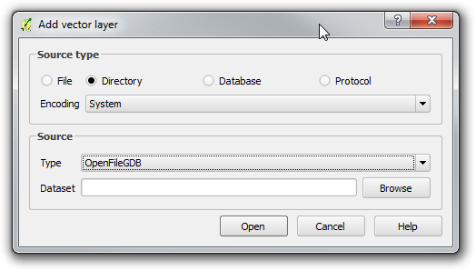
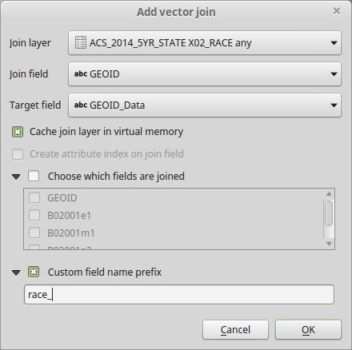
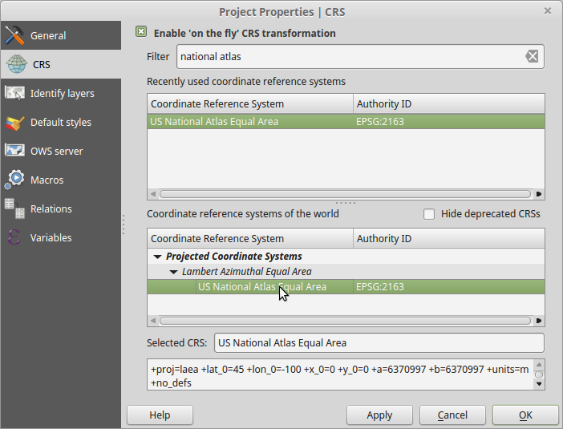
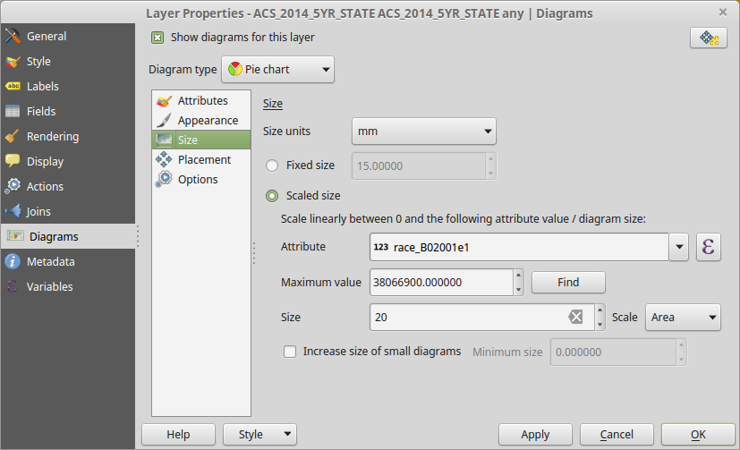

% Introduction to American Community Survey with QGIS
% Prof. Hachadoorian
% Summer II 2016

# Overview

* Become familiar with the QGIS interface.
* Become familiar with American Community Survey Data.
* Create a basic thematic map in QGIS.

# Downloading Data from the Census Bureau

American Community Survey data are available from a wide variety of US Census Bureau and value-added sources such as the USCB's FTP server, American Fact Finder, National Historical GIS, and Social Explorer. Census data has two important parts: geographies (spatial layers) and demographic tables (attribute tables). Although these data can be downloaded separately, a selection of commonly used ACS demographic tables are packaged with the geographies in the ESRI File Geodatabase format.

In order to get practice using this data, go to the [TIGER/Line® with Selected Demographic and Economic Data](http://www.census.gov/geo/maps-data/data/tiger-data.html) download page. Expand the section for the most recent ACS 5-Year Estimates (2010-2014 Detailed Tables a/o this writing). Click the links to download the Geodatabase for the State and Metropolitan/Micropolitan Statistical Area geographies.

Depending on your web browser settings, you may be prompted for a location to save the file, or your browser may automatically save it to a default Downloads folder. Save it or copy it to a folder where you will store all your data for this course. If you are working on a lab computer, I highly recommend that you save all your data and all your work to your flash drive.

In each case you will end up with a ZIP file containing the geodatabase. Unzip the file using 7-Zip or your computer's ZIP utility. In many operating systems this can be accomplished by right-clicking the ZIP file in the file manager (Finder on Mac, Windows Explorer on Windows) and choosing "Extract Here" or a similar option. You will end up with a folder with the extension `gdb`, for example `ACS_2014_5YR_STATE.gdb`. Although you can look inside this folder in the file manager, you should not edit or delete any of these files, or store any other files in this folder!

Later in the course you may want to work with smaller geography data such as Census Tracts. These can be downloaded by state or for the entire country at once. The national file is 2 GB zipped and over 10 GB unzipped!

# Adding and Joining Data in QGIS

Open QGIS Desktop (*not* QGIS Browser) by double-clicking the icon on your desktop, or find it in the Start Menu in the OSGeo4W folder.

\ 

The central pane is where you will see the geographic data that you add. The left and right panes are dockable panels that can be torn off (grab the title bar of the panel) if you prefer floating panels in your workspace. We won't be using the Processing Toolbox today, so if it is open (by default in a right-hand panel) you can close it in order to increase the area avaialable for the map canvas. The left panel is the Layers pane. This will be an index of layers you have added.

Now let's add some data. QGIS allows you to easily add file-based data (such as shapefiles) as well as data from web map services (WMS, WCS, WFS) and spatial databases (such as PostGIS). In order to add ESRI File Geodatabase layers, click the  Add Vector Layer button. In the top pane, set the Source type to Directory. In the bottom pane, set the Type dropdown to "OpenFileGDB".^[The OpenFileGDB driver is a read-only, open source driver. Computers with ArcGIS installed may have an option for the "ESRI FileGDB" driver. Since we will not be making any changes to the data, we can use the OpenFileGDB driver. If you intended to alter any of the data, you would have to use the native ESRI FileGDB driver.] The dialog should look like this (the exact path will depend on where you downloaded your data):

\ 

You should then see a list of layers to be added. You can control-click to select multiple layers, or hit Select All to add all of them. Add as many as you want, but at least the following:

* `ACS_2014_5YR_STATE`: This contains the geometry data
* `STATE_METADATA_2014`: This contains the column names and meanings, for example `B02001e5` = "RACE: Asian alone: Total population -- (Estimate)".
* `X02_RACE`
* `X19_INCOME`

Searching `STATE_METADATA_2014` for data you are interested in may be somewhat difficult. The metadata is also available in text or Excel files available on the [ACS Summary File Documentation](http://www.census.gov/programs-surveys/acs/technical-documentation/summary-file-documentation.html) web page in the section called "Sequence Number/Table Number Lookup File". If you use the text or Excel files note the following.

* The TableID corresponds to the beginning of the column name, up to the lower case letter `e` or `m`.
* The lower case `e` indicates an **estimate**, while `m` indicates a **margin of error**.
* The number after `e` or `m` corresponds to the Line Number in the Excel or text lookup file.

Although we haven't done much yet, it is a good idea to save your work early and often. Hit `Ctrl+S` to save your QGIS document. Make sure to save it to your flash drive or other working folder. As you continue to work, periodically hit `Ctrl+S`, especially after making any signficant changes to your map.

In order to map the demographic data, we need to join it to the spatial layer. Double-click the `ACS_2014_5YR_STATE` layer in the Layers Panel. In the left column, choose the Joins tab. At the bottom of the window hit the Green plus sign to open the Add vector join dialog. For the Join layer, choose `X02_RACE`. Set the Join field (which is in the **attribute** table) to `GEOID`. Set the Target field (which is in the **spatial** table) to `GEOID_Data`. **Do NOT set the Target field to `GEOID`**. In spite of the same name, these fields do not have identical data which can be used to do the join!

When the `X02_RACE` table gets joined, the fields will appear in the `ACS_2014_5YR_STATE`. Because field names may be duplicated (`GEOID` is a case in point), the joined fields will appear with a prefix. The default is the name of the join layer, which in this case is the rather unwieldy `ACS_2014_5YR_STATE X02_RACE any_`. Click the checkbox for a Custom field name prefix, and shorten the prefix to `race_`.

After setting these parameters, your dialog should look like this:

\ 

Hit OK. Then hit OK again to close the Layer Properties dialog.

The `ACS_2014_5YR_STATE` should still be selected in the Layers Panel. (If it is not, single-click to select it.) Hit the Open Attribute Table toolbar button , or right-click the layer and select Open Attribute Table from the popup menu. Scroll to the right of the table grid to see the new columns that have been joined.

# Cartographic Display of Demographic Data

## Selecting a Projection

Each spatial layer has a projection associated with it, which is a set of equations that determine how the curved surface of the earth is represented on a two-dimensional sheet of paper or computer screen. QGIS defaults to showing the data in latitude and longitude. We want to use a projection appropriate for the Continental US. Click the Project CRS button in the lower right of the QGIS window (looks like a globe with the text "EPSG:4326" next to it). The Project Properties dialog will open to the CRS tab. We're going to use the US National Atlas Equal Area projection. You can search for it by typing "national atlas" into the filter. Then click the name of the projection in the lower pane:

\ 

Hit OK to apply it, and zoom in to roughly the area of the Continental US (that is, the area not including Alaska, Hawaii, and Puerto Rico).

## Create a Choropleth Map

A **choropleth** map is a map that colors the geographic entity (states in this tutorial) based on the value of underlying attribute data. Choropleths should virtually never be used to represent raw count data! They should be used for densities (population per unit area), rates (cases or incidents, such as a disease or crime, per population), or proportions (such as percent of the population in a racial or ethnic group). Let's make a map of the percent of the population in each state which is African-American.

Open the Layer Properties dialog and select the Style tab in the left pane. At the top, the symbol type for a new layer is set to a default of Single Symbol.

1. Click the dropdown that says "Single Symbol" and change it to "Graduated", which is appropriate for numeric data.
2. In the Column box, you can use the dropdown to select a column name, type in an expression, or click the Expression Editor button . The field representing "Black or African American alone" is `B02001e3`. The field representing "Total Population" is `B02001e1`. Therefore, you can show the percentage African American by typing the following formula into the box: `100 * race_B02001e3 / race_B02001e1`.
3. Select a **sequential** color ramp from the Color ramp dropdown. A sequential color ramp is one that progresses from light to dark. A **diverging** color ramp is light in the middle but progresses to two different hues (e.g. blue and bronw) at the extremes.
4. In the Mode dropdown, choose "Natural Breaks (Jenks)".
5. Set the number of classes to either 5 or 7.
6. If the list of classes with varying color symbols has not already appeared in the central white pane, click the Classify button just above it.
7. Hit OK to see your map.

## Create a Proportional Symbol Pie Chart Map

Magnitude data, like counts, can be represented using a so-called **proportional symbol map**, where a symbol such as a circle is sized relative to the underlying data values. (Sometimes, usually by non-geographers, this is referred to as a bubble map or bubble chart.) For data that adds up to a total, we may display the result using a pie chart. The pie chart size is controlled by total population, and the pie chart itself shows the components of the total. For example, for housing, you could display a pie chart with wedges showing renter-occupied, owner-occupied, and vacant housing. We will display a pie chart showing wedges based on the count of population of a given race. (For the present exercise, we will ignore the categories "Some other race" and "Two or more races".)

To add the pie charts, open the Layer Properties dialog and click the Diagrams tab in the left-hand pane. Then check the box "Show diagrams for this layer" at the top of the dialog. The Diagram type should default to Pie chart, but if it doesn't select it from the dropdown.

There are five settings groupings: Attributes, Appearance, Size, Placement, and Options. We will make changes in three of them:

* Attributes: Select the following fields in the Available attributes pane, and click the green plus sign so that they appear in the Assigned attributes pane:
    * `race_B02001e2` - White alone
    * `race_B02001e3` - Black or African American alone
    * `race_B02001e4` - American Indian and Alaska Native alone
    * `race_B02001e5` - Asian alone
    * `race_B02001e6` - Native Hawaiian and Other Pacific Islander alone
* Size: Click the Scaled size radio button
    * Attribute: Set to `race_B02001e1`, which is the total population of all races
    * Maximum value: Click the Find button to determine the largest value in the selected field, `race_B02001e1`. **NOTE: As of QGIS 2.14.3, this appears not to work with joined data. Therefore, you may have to exit this dialog and inspect the attribute table yourself to find the largest value. You can do this by clicking on the top of the `race_B02001e1` column to sort the data in that column.**
    * Size: This number represents the Area (default) or Diameter of pie chart. For magnitude data, you always want this to be the Area. The default is 50. Depending on your map, this symbols may be too large or too smale. For this data at this scale, I would suggest experimenting with values between about 15 and 30. (See image below.)
* Placement: Set the Placement dropdown to Over Centroid

\ 

Click OK to close the dialog.

Note that the Pie Chart is also what you would use to set a proportional symbol for a single magnitude value, like total population. Just choose a single value in the Attributes panel and choose the same attribute to control the size in the Size panel.

# Creating a Print Layout

## Setting up the Layout

In order to create a print layout, we set it up in a separate window called the Print Composer. Choose `Project→New Print Composer`. A window will open up that, as with desktop publishing software, looks like a piece of paper on a pasteboard. Before adding any elements, let's set up the window to make it easy to work with visually. In the lower right, you will see a panel with three tabs: Composition, Item Properties, and Atlas Generation. Choose the Composition tab. Under `Paper and quality`, choose the preset for "ANSI A (Letter; 8.5x11 in)". Check `Snap to grid` and set the spacing to 4.23 mm. (This is roughly equal to 1/6", which in desktop publishing is known as a **pica**.) The symbol is a bit thick, so you might want to make the `Pen width` something like 0.2 mm. 

## Adding the Map

Now we will add the main map. Click the `Add new map` button . Place your map on the page by clicking and dragging over the area that you want the image to fill. Draw the map to cover most of the page. Leave room for a title at top, and a legend to the right. *The snap-to-guides feature will not be in effect while tracing the dimensions of new layout item,* so after you draw it, drag it so that it snaps to the upper-left corner of the layout, then grab the lower-right corner and drag it so that it snaps to the desired position. The Median Income layer and the OpenStreetMaps layer should be visible. 

At this point you may want to adjust the viewable area of your map. Click the `Move item content` button . You can now click within the map frame to reposition it. You can use the scroll wheel on your mouse to move in and out (although the zoom steps may be somewhat gross). There is no click-and-drag zoom tool (the magnifiying glass), but you can switch back to the main QGIS window, zoom to desired level, then switch back to the Print Composer and hit the Refresh button. It's very hard to give precise instructions about how to do this--just play around with the tools. You want the metropolitan area to fill the area of the main map.

## Adding Supporting Elements to the Page

Now add a title using the `Add new label` tool .^[Note, QGIS does not distinguish between adding a label and adding a title, the way ArcMap does.] Select the tool and click in the map in the top left of the page. The label will immediately appear with some dummy text. Position it in the upper left corner, and drag the lower right corner to fill an area roughly 3 picas tall and stretching across the top of the page. In the Item Properties tab, change the label text to an appropriate title for your map. Click the Font button, and set the font to Arial Black^[It is better to use a font constructed as bold ("Black", "Heavy") or italic ("Oblique") than to take a base typeface like Arial and apply bold or italic to it.] 24. Set the Alignment to Horizontal=Center and Vertical=Bottom. If the title is long enough to wrap to a second line, make the font size smaller.

Click the `Add new legend` tool  and drop a legend in the empty area to the right. The legend will appear with entries for *all* layers in your map. If you're only interested in a particular layer, in the Item Properties tab, expand the Legend items section, select and delete (using the large red minus icon) any layers you don't want to appear in the legend. Below the legend, add sources and any additional information you want, including your name. Depending upon the steps taken for a particular map, you may credit yourself for "Cartography" or for "Analysis and Cartography". For this map, just "Cartography" is appropriate. The data are from the American Community Survey 2014 5-year Average. Date your work. Add any other explanatory text or credits that you want. You may add a scale bar and North arrow, but for thematic maps (as opposed to reference maps) these elements are not strictly necessary, and can just clutter your layout.

## Exporting the Image

You export your map to several formats. There are three options: PDF, SVG, and Image. PDF is a good format for maps intended to be printed. SVG stands for Scalable Vector Graphics, and is theoretically a good format for much digitial imagery, but the SVG export option in QGIS is buggy, so you should avoid it for now. Choosing `Export as Image` actually gives the option of a wide variety of image formats, including PNG which is a good choice for web images.

# ASSIGNMENT

Add the MSA (Metropolitan/Micropolitan Statistical Area) data that you also downloaded to your map. Create a map with the following characteristics:

1. Use a sequential color ramp to display Median Household Income by state. You will have to look up the correct column name in the metadata table in QGIS or in the lookup table that you downloaded.
2. Join the race data to the MSA layer.
3. In the Style tab, create a single-symbol symbology for the MSA, but make the symbol invisible (no fill, no border).
4. Add a diagram to the MSA that is a pie chart with major racial categories as the wedges, and symbol size controlled by total population. These should be the same column (`B02001e...`) that you used earlier in the exercise.
5. Create a layout and export it to PNG using `Export as Image`.
