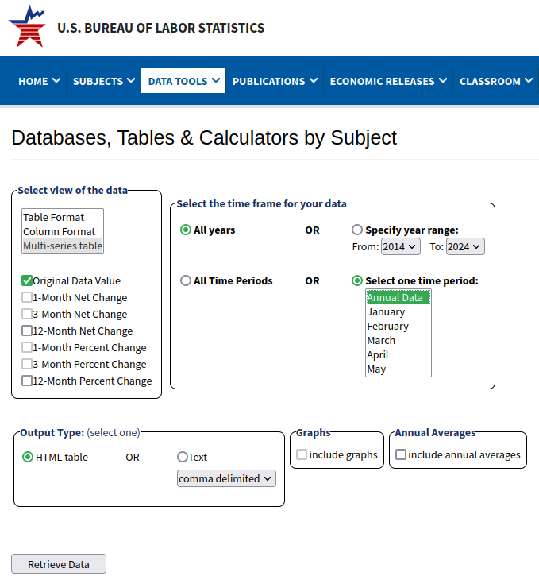

# Overview

A shift-share analysis is used to examine employment growth or decline
in a region (state, MSA, etc.). Imagine that over a period of time a
local industry, such as tech, gains employees, or an industry such as
manufacturing loses employees. We might first ask “What about national
conditions?” If the entire economy gained or lost employment during that
period, the performance of the local economy may be better or worse. We
may next ask “What about the national industry?” If manufacturing is
losing jobs across the country, a local economy that loses manufacturing
jobs but *not as much* may in fact have a very healthy local
manufacturing economy. If tech is growing around the country, a local
economy that gains tech jobs but *not as much* may in fact have a fairly
weak local tech economy. The remainder after accounting for national and
industrial conditions is the “local share”, and can given an indication
whether a local economy is doing well or poorly, and what the local
industrial drivers are.

# Data

First, download the file [Shift-Share
Template.ods](https://github.com/temple-geography/census-gis/blob/master/Shift-Share%20Template.ods).
This file contains national employment data for economic sectors from
1990 to 2018. You will need to download analogous data for a
metropolitan area in order to conduct a shift-share analysis for the
area. The professor will demonstrate using data from the
Philadelphia-Camden-Wilmington MSA. Therefore, you may choose any MSA
*except* Philadelphia.

Begin on the BLS Databases, Tables & Calculators by Subject page at
<http://www.bls.gov/data/>. Scroll down to the Employment section. The
second entry should be “Employment, Hours, and Earnings - State and
Metro Area (Current Employment Statistics - CES)”. Click the yellow
button for “Multi-Screen Data Search”.\[1\] Then follow along on the
subsequent web pages:

1.  Seasonal (Screen 1 of 7): Check “Not Seasonally Adjusted” and click
    Next Form.

2.  Datatype (Screen 2 of 7): Select “01 All Employees, In Thousands”.
    Click Next Form.

3.  State (Screen 3 of 7): Select a state of interest. On the next
    screen we will be selecting a metropolitan area. Metropolitan areas
    can cross state borders. Choose the state associated with the
    “principal city” of the MSA. Click Next Form.

4.  Area (Screen 4 of 7): Select a metropoltian area of interest. Click
    Next Form.

5.  Supersector (Screen 5 of 7): Select *all* the two-digit supersectors
    in the listbox and click Next Form.

6.  Industry (Screen 6 of 7): NAICS codes are hierarchical. NAICS
    sectors are two digit codes, e.g. NAICS 42 is Retail Traide, which
    appears in this list as `42000000`. In order to restrict our
    selection to sectors and supersectors, enter `??000000` in the Code
    textbox (at the bottom) and hit the Search button. The list is now
    restricted to codes with any two characters followed by six zeroes.
    Select *all* of the industries in the listbox and click Next Form.

7.  Year (Screen 7 of 7): In spite of the name, you are not selecting
    the year on this page. This just shows the codes representing the
    data series you have chosen. Hit the Retrieve Data button.

8.  The output page will show the data in a difficult to use format.
    (Each sector will be a separate table, and the table will show rows
    by year and months by column.) In order to get the table in a usable
    format, click the link for “More Formatting Options” in the upper
    right.

9.  On the next page, check the following settings:
    
      - Select view of the data = “Multi-series table”. Make sure that
        only “Original Data Value” is checked (should be the default).
      - Select the time frame for your data. Check:
          - All years
          - Select one time period: Annual Data
      - Output Type: HTML table. In spite of the name, when you get to
        the next page you will have the option of downloading an Excel
        spreadsheet.
    
    Your selections should look like this:
    
     
    
    Then hit the Retrieve Data button.

# Using the Shift-Share Spreadsheet

1.  Open the file `Shift-Share Template.xls`. Look at the sheet named
    `Shift-Share Table`. What you see is a list of economic
    supersectors, which are extremely broad collections of industries.
    Supersectors which are indented are subgroups. For example, 41, 42,
    and 43 are subgroups of 40, and the numbers in those rows (if
    reported, see step 4) will add up to the value for the parent row.
    
    The columns are where we will enter formulae to understand the
    national, industry, and local effects in employment growth or
    decline.

2.  Determine your start and end years. The United States economies
    experienced recessions from July 1990 to March 1991, March 2001 to
    November 2001, and December 2007 to June 2009. Employment troughs
    came in 1991, 2003, and 2010, while employment peaks came in 2001
    and 2007. In each group one person should do a shift-share analysis
    for one of the following periods:
    
    1.  1991 – 2001, trough to peak growth during the Clinton years
    2.  2001 – 2007, peak to peak growth from the tech bubble to housing
        bubble
    3.  2010 – 2013, the Great Recession recovery period
    4.  1990 – 2018, the entire period we have data for
    
    Enter the start year in cell C2 and the end year in cell D2.

3.  The national data are available on the sheet named `National
    Employment`. Copy the data for your start year to column G and for
    your end year to column H. The number of cells should fit exactly.

4.  Not every metropolitan area will report data for every supersector.
    Nondisclosure rules require BLS to suppress the data for groupings
    with fewer than three firms, or where one firm has 80% or more of
    area employment. Your metropolitan area may be missing some of these
    lines, or some may be smashed together into pseuod-sectors like 15,
    which is just a grouping of 10 and 20 used to avoid disclosure
    rather than a “real” supersector. Before transferring your
    metropolitan data to this form, make sure that there are no missing
    lines, and add any rows if necessary. By adding an entire row, the
    supersectors should stay aligned with the national data that you
    have already copied into columns G and H. **You do *not* have to
    delete any lines which are missing from your data.**

5.  Now copy over the metropolitan data you downloaded prior to class.
    If you followed the instructions, your data should be in the same
    format as the data on the `National Employment` sheet, although you
    may not have the exact same supersectors. Paste the start year data
    into column C and the end year data into column D.
    
    Now, make sure your supersectors match up with the row headings.
    Insert cells or delete cells using the “shift up” or “shift down”
    option to get your two columns of pasted data to line up with the
    correct supersectors.

6.  Now that we have the data, we need to calculate the shares. First,
    we need to know the absolute change (difference) in employment level
    for each supersector. Then we need to convert this into a percentage
    (divide the difference by the starting value). Then we figure out
    the national, industry, and local effects in percentage terms.
    Finally, we calculate the actual number of jobs gained or lost by
    multiplying this percentage by the starting value.
    
    1.  In cell E3 enter `=D3-C3`.
    2.  In cell F3 enter `=E3/C3`. Then format this cell to display as a
        percentage by clicking the percent icon on the toolbar, or going
        to Format → Cells in the menu.
    3.  We need to do the same thing for national growth, so copy cells
        E3 and F3 and paste them into I3 and J3. Note that the formulae
        have changed so that I3 is set to `=H3-G3`. This is because we
        entered the formulae using *relative references*. In effect,
        when we entered the formula in cell E3, the spreadsheet software
        doesn’t interpret D3 as literally column D, row 3, it interprets
        it as “go one cell to the left on the same row”. So when you
        paste this formula into a new cell, the formula gets updated.
    4.  The first component of the shift-share is the national share.
        This is the growth that is expected due to national growth in
        the economy as a whole (all industries). This value appears in
        cell J3, the percent change in employment in supersector 00
        Total Nonfarm. We want this value to appear in all rows of
        column K. In order to paste the formula so that it does *not*
        change when we copy it, we are going to use *absolute
        references* by putting a dollar sign in front of the column and
        row. So in cell K3 enter `=$J$3`. Format the cell to display
        percentages.
    5.  The second component of the shift-share is the industry share.
        This is the growth that is expected due to industry growth at
        the national level. This is just industry growth minus national
        growth. So in cell M3 enter `=J3-K3`. Format the cell to display
        percentages. (Note, since line 3 *is* the total economy, this
        value will be 0.)
    6.  The final component of the shift-share is the local share. This
        is the growth that is “left over” after national and industry
        growth is accounted for. It is sometimes referred to as
        competitive advantage, because it is supposed to quantify
        undefined aspects of the local economy that lead to higher or
        lower than expected growth. This is equal to the local growth in
        that industry minus the national growth in that industry. In
        cell O3 enter `=F3-J3`.
    7.  Now we want to know the actual numbers of jobs added or lost, so
        we multiply these percentages by the start year employment in
        each industry. In cell L3, enter `=$C3*K3`. Notice that we are
        using the absolute references ($) to pin the start year values
        to column C, while allowing the row to vary. Now we can copy
        this cell and paste it into cells N3 and P3. Note how the
        formulae have changed.
    8.  The entire top row of our table is now complete. Because we have
        used a combination of absolute and relative cell references, we
        can copy this row down to fill the rest of the table. Select the
        entire block of cells from the top row to the bottom row (the
        empty row for the supersector 93 Local Government). Now hit
        Ctrl+D on your keyboard (Cmd+D on the Mac?), or go to
        Edit→Fill→Down on the menu.

7.  Your table should now be complete. Discuss with your group how your
    metropolitan area performed during each of the time periods.
    Overall, the national economy has lost manufacturing jobs and gained
    service sector jobs. Did your metro benefit from its industrial mix,
    or was it harmed by it? Are there any supersectors for which your
    metro has a competitive advantage, i.e. has outperformed the
    national industry? Has government employment been important to the
    local economy?

# ASSIGNMENT

Turn in your Excel spreadsheet, and some comments (a paragraph or two is
fine) about your discussion with your group about the components of
growth and decline in your metropolitan area.

1.  Note the "One-Screen Data Search *may* be easier to use, but (a)
    requires Java to be installed and enabled on your computer, and (b)
    provides less information during the data selection process, so a
    little more obtuse for new users.
