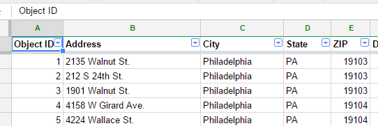
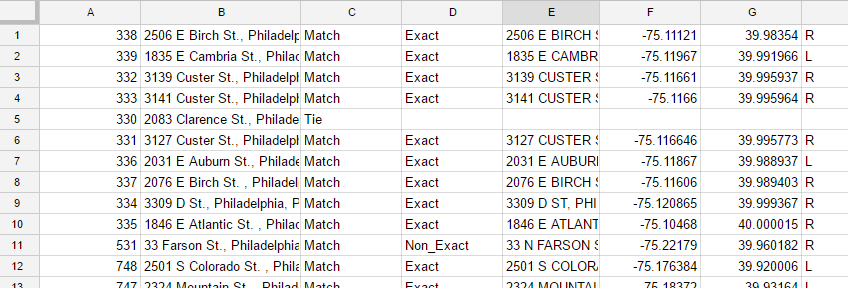
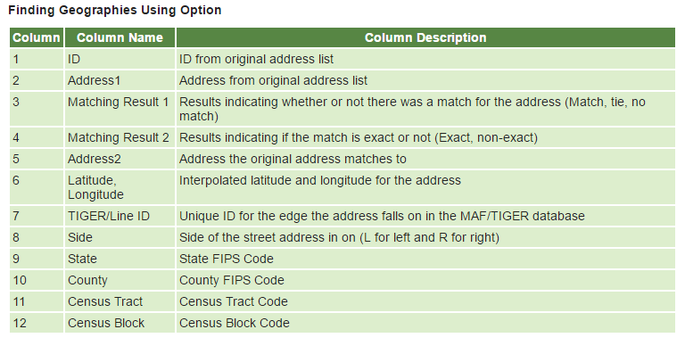
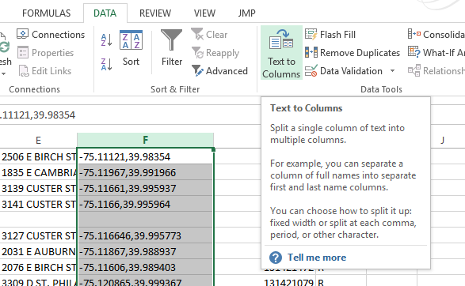
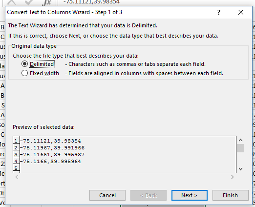
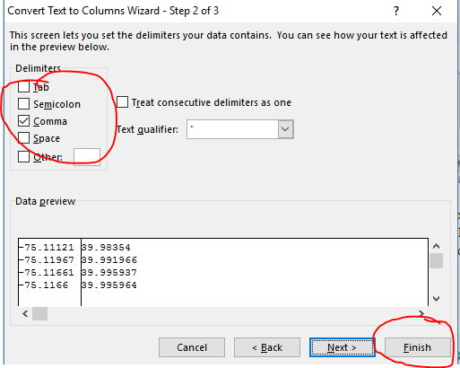
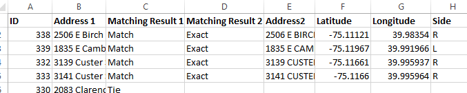
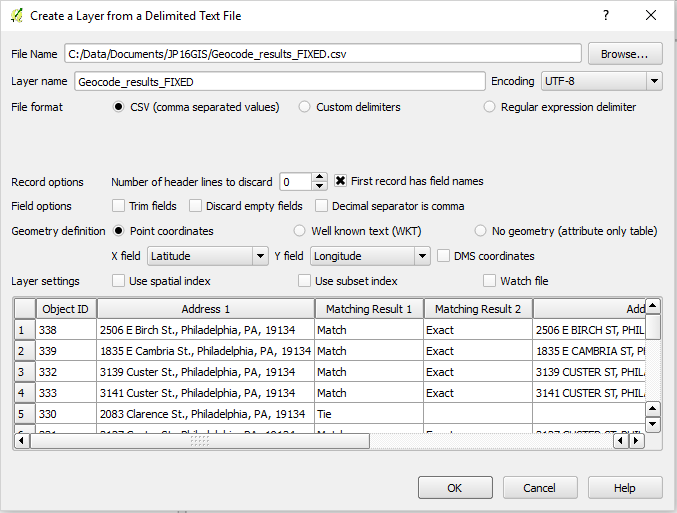
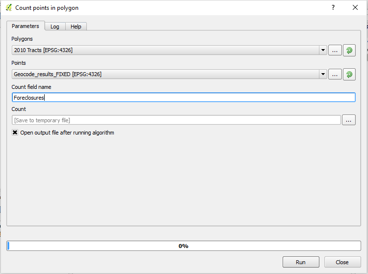
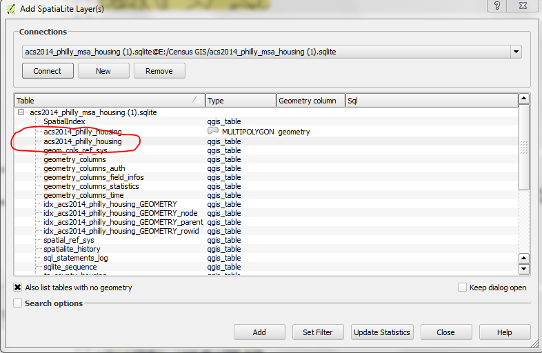

Using the US Census Geocoder
============================

Developed by:

* Heather Squire [heather.squire@temple.edu](mailto:heather.squire@temple.edu)
* Josefina Peralta [tug88995@temple.edu](mailto:tug88995@temple.edu)

Overview
========
In this lab we will be looking at 2016 foreclosure data for the City of Philadelphia and comparing it to demographic data at the Census tract level in order to see if there are any possible relationships to explore further. To do this you will first have to geocode the addresses of foreclosed homes using the US Census Geocoder.

Data
====

[Download the data](https://docs.google.com/a/temple.edu/folderview?id=0B3Ek46A1ccaQc3BZS0pKQzRpcHM&usp=drive_web)

The data we will be using for this lab are:
- 2016 Philadelphia Foreclosures (addresses gathered from Redfin, a real estate tracking website [http:www.redfin.com](http:www.redfin.com))
- 2010 Philadelphia Census Tracts with housing info from Lab 3 
- 2015 American Community Housing Survey 
- ACS 2014-2016 Data from previous labs.

Formatting Data for Geocoding
=========================
The US Census provides a valuable tool for easily geocoding addresses.

We are able to geocode individual addresses or *batch geocode* up to 1000 addresses. There are over 800 foreclosed homes in Philadelphia, so we will batch geocode using a spreadsheet. Addresses *must* be added in the following format to prevent errors:

\ 

Once all addresses have been added to your spreadsheet, the spreadsheet must be saved in **CSV** format (Comma Separated Values; .csv). This has already been done in the data above. The format is important if you plan to geocode through the Census Geocoder in the future. 

Geocoding with the Census Geocoder 
===========================
- Go to <https://geocoding.geo.census.gov/>
- Under "Find Geographies Using..." go to **Address Batch**
- Upload the 2016 Philadelphia Foreclosures CSV file
- Hit **Get Results** [Note: The Benchmark/Vintage are automatically set for current data.] Results may take a few minutes. 
- Download the data file called **GeocodeResults.csv**

The result of the Geocode should be in the following format:

\ 

Note: Addresses are exact or non_exact, but both are able to be mapped. The Census geocoder conveniently transfers the zip code information into census tracts. Below are the resulting fields from the geocoder:

\ 

In order to transfer this into QGIS, we have to separate Latitude and Longitude (`Column F`) into two separate columns. In an Excel spreadsheet, Select (`Column F`) and then click on **Text to Columns** under the **Data** tab.

\ 

Under "Original data type" select **Delimited** and then click **Next**

\ 

Choose the **Comma Delimiter**, then Press **Finish**. You now have two separate columns with Latitude and Longitude. 

\ 

Rename the columns according to the Census Output results in Excel to make transferring data to QGIS easier. *Make sure the Latitude and Longitude are correctly labeled.*

\ 

Mapping Results
============== 
Add the 2010 Census Tracts to your map. 

Go to `Layer` > `Add Layer` > `Add Delimited Text Layer` , or use the button . 

Add your Geocode Result CSV file. Your dialog box should look like the following:  

\ 

Hit OK. 

[Note: If the projection is missing, the 2.16 version of QGIS assumes a projection with Latitude and Longitude which is the appropriate projection for this lab exercise. If you are using an older version of QGIS, it will prompt you for a projection, which in this case is WSG 84.]

We have created a point shapefile from this data. We want to transfer that information to create a count of foreclosures per census tract. As in a previous lab, we will be using the Count Points to Polygon tool. 

Go to `Toolbox` > `Geoalgorithms` > `Vector` > `Statistics` > `Count Points in Polygon`. 
It should look like the following: 

\ 

Rather than the the actual number of foreclosures, we are interested in mapping the foreclosure rate, which compares the number of foreclosures in the census tract to the total number of residential housing units in that tract. We are interested in the 2010 adjusted housing rate per census tract which we created in Lab 3. In order to compare the two, we have to **join** our lab data from Lab 3 by connecting to the **acs2014_philly_msa_housing** Spatialite database in QGIS. Select `Also list tables with no geometry` and then select `acs2014_philly_housing` and click `Add`.

\ 

Now we are able to join the housing data to our tracts shapefile.  Perform a spatial join based on Census tract.

Assignment 
==========

Create two side-by-side choropleth maps comparing foreclosure rate in Philadelphia with some other demographic attribute along census tracts, which you think may be related to foreclosures (ie: race, income, poverty rate, etc.). Use the ACS 2014 data from previous labs. Make sure to set an appropriate projection. Include a title and legend that adequately communicate the relationship your two maps describe.

*Hint: In order to create the choropleth map for foreclosure rate, make sure to use the Expression Dialog under the Graduated Symbology section.* 

