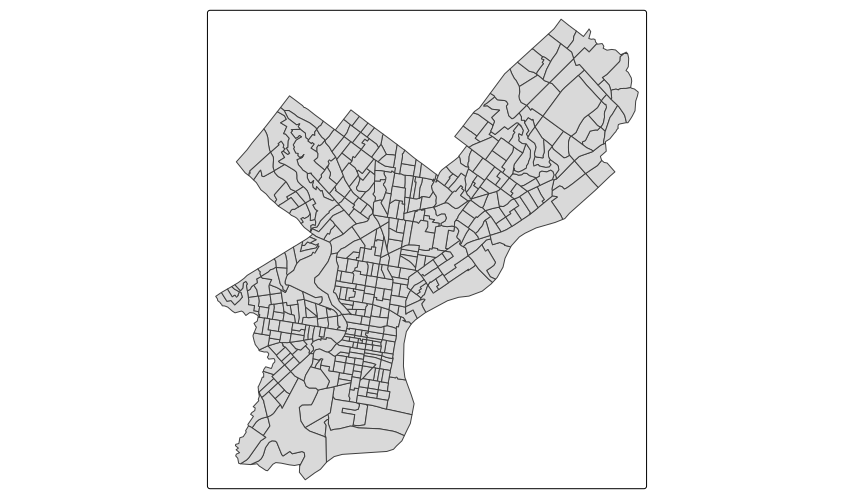
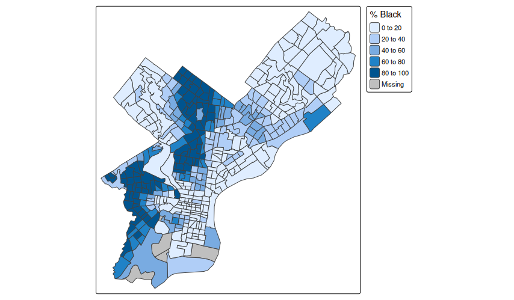
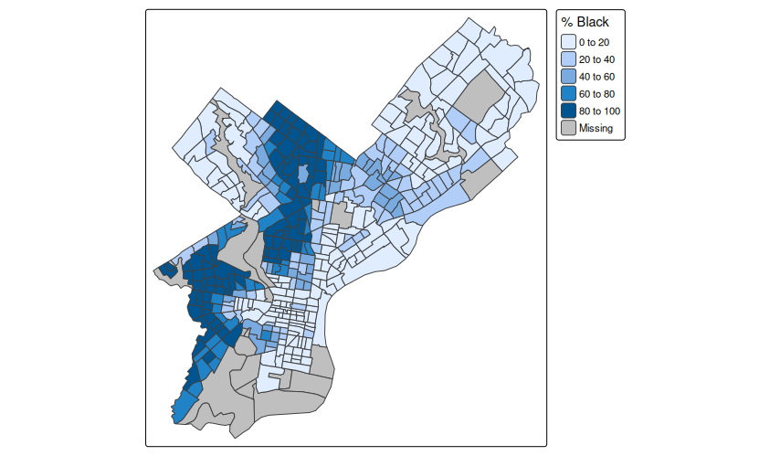
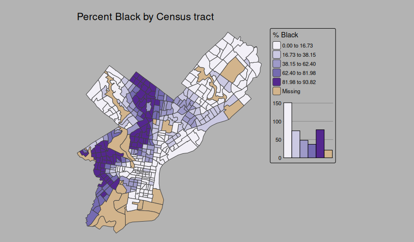
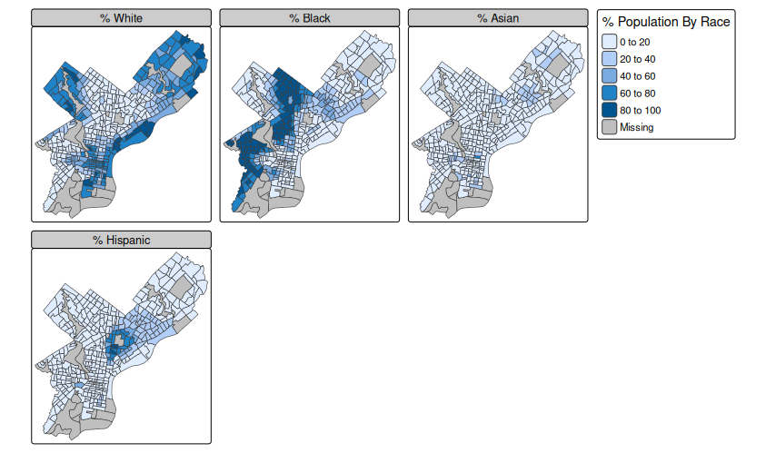
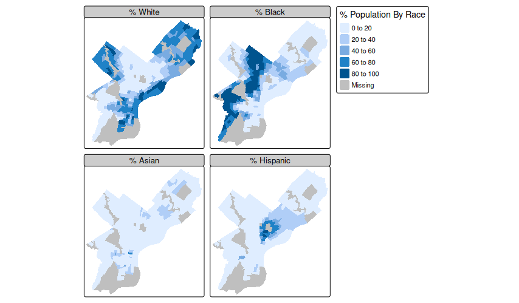

# Exercise: Map-Making with Tmap v4

🛠️ **UNDER CONSTRUCTION** 🛠️

This assignment roughly follows the structure of *Analyzing U.S. Census Data* [6.3 Map-making with tmap](https://walker-data.com/census-r/mapping-census-data-with-r.html#map-making-with-tmap). However, **tmap** underwent big changes between versions 3 and 4. *AUSCD* 6.3 is written for **tmap** 3.x. I cover similar material here, while updating the code for the just-released (Jan 2025) **tmap** 4.0.

# TUTORIAL

This tutorial assumes that you already have explored the basics of **tidycensus** and **tidyverse** presented in *AUSCD* Chs. 2 and 3.

## Downloading Race and Hispanic Origin Data

Begin with our usual imports, and also import **tmap**.

```r
library(tidyverse)
library(tidycensus)
options(tigris_use_cache=TRUE)
library(tmap)
```

So far, we have mostly *not* worked with Census geometries. Now we are going to use **tidycensus** to download geometries as well as demographic data for Census tracts in Philadelphia. The additional line `options(tigris_use_cache=TRUE)`{.r} will prevent **tidycensus** from redownloading the spatial data files if they have already been downloaded. They are automatically stored in a cache directory private to **tidycensus**. You don't have to worry about where they are stored (although advanced users can configure the location of the cache directory).

We start by specifying the Census variables we will download. Usually, I prefer to use `lower_case_with_underscores` for column names. However, these variable names will also appear in the legend of the maps we create. We will therefore use columns names that will serve as display names in the legend. (Note that the display names can be overridden in the legend, but I want to limit the content in this introduction.)

The race and Hispanic origin variables come from the DHC (Demographic and Housing Characteristics) file of the 2020 Census.

```r
race_vars = c(
  Total = "P5_001N",
  White = "P5_003N",
  Black = "P5_004N",
  AIAN = "P5_005N",
  Asian = "P5_006N",
  HIPI = "P5_007N",
  Other = "P5_008N",
  `Two or More` = "P5_009N",
  Hispanic = "P5_010N"
)
```

Remember that **tidycensus** can download data in "tidy" (long) format (variables in rows) or "wide" format (variables in columns). So far we have mostly worked with long format. For GIS and mapping, we usually want wide format. We also explicitly request geometries (the default is `geometry = FALSE`{.r}). The following statement requests the data from the Census API. I store it in its original form (other than some column renaming at the end) prefixed with `zz_`. I do this because, as we experiment with altering the data, I want to be able to start over without having to repeat the Census API call, which will be the slowest part of this tutorial. (The use of `zz_` is just my preference, because it keeps those data frames alphabetically at the end, and kind of "out of the way" when I list objects in my R environment. You may prefer a different prefix.)

```r
zz_philly_race = get_decennial(
  geography = "tract",
  state = "PA",
  county = "Philadelphia",
  variables = race_vars,
  year = 2020,
  sumfile = "dhc",
  geometry = TRUE,
  output = "wide"
) %>% rename(geoid = GEOID, name = NAME)
```

The `qtm()` function ("quick thematic map") let's us look at the geometries.

```r
qtm(zz_philly_race)
```



## Choropleth Maps with Tmap

So far, not very interesting. Let's start with a basic choropleth map. A choropleth is a map of polygons that are colored by an underlying data value. It is arguably the most common way to visually explore Census data, and a good place to start.

**One important thing to keep in mind about choropleths is that they should (almost) never be used to map raw count data.** As the area of a polygon gets larger, the counts usually go up as well. It may be true that in the United States there are some small area states (like New Jersey) that are very urban, and some large area states (like Wyoming) that are very rural, but on average large area states will have larger populations than small area states. If you make a chorpleth map of a raw count, you will tend to just make a map that shows more people living in larger areas.

We will address this by converting the raw counts to percentages. We create our main data frame, `philly_race`, while leaving the original data untouched. We use backticks (`\`...\``) to create column names that have spaces and special characters (like `%`).

```r
philly_race = philly_race %>%
  mutate(
    `% White` = 100 * (White / Total),
    `% Black` = 100 * (Black / Total),
    `% AIAN` = 100 * (AIAN / Total),
    `% Asian` = 100 * (Asian / Total),
    `% HIPI` = 100 * (HIPI / Total),
    `% Other` = 100 * (Other / Total),
    `% Two or More` = 100 * (`Two or More` / Total),
    `% Hispanic` = 100 * (Hispanic / Total),
  )
```

Now we can use `qtm()` to make a quick map by adding the name of one of our data columns. We will use percentage Black. Note that **tmap** requires the data variable names (the columns of the data frame) to be passed using quotation marks (`"..."`).

```r
qtm(philly_race, "% Black")
```



This created a choropleth map with some useful defaults. Since percentage Black is a numeric variable, **tmap** is automatically picking a sequential color scheme (light to dark blue), one that is used for visually displaying increasing values. Later on we will also practice using a categorical color scheme. It also broke the numeric data into 5 classes using "pretty" breaks, that is, the classes are broken on round numbers. These are default behaviors, and many other choices are possible.

Some areas are assigned the value "Missing", but if you are familiar with Philadelphia geography, you may notice that there is population showing up in large park or industrial areas. **Census tracts numbered in the 9000s are special land use areas, that may include parks, water, and institutional facilites.** It is often a good idea to exclude these tracts from demographic analysis and visualization.

There are several ways we could accomplish this. One way is to convert the percentages for tracts numbered 9xxx to `NA`, the special R value for missing data. The quick way to do that is to make the total population for tracts numbered 9xxx `NA`, and then recalculate the percentages. Since the GEOIDs for all tracts in Philadelphia begin with `42101` (`42` for Pennsylvania, `101` for Philadelphia County), we just need to check to see if the sixth character in the GEOID is a `9`.

Here, we recreate `philly_race` from our original download, using the `if_else()` function to replace the total population with `NA` *if* the sixth character in `geoid` matches `"9"`. Then we recalculate the percentages. Finally, we recreate the map.

```r
philly_race = zz_philly_race %>%
  mutate(Total = if_else(str_sub(geoid, 6, 6) == "9", NA, Total))

# Repeat of earlier code
philly_race = philly_race %>%
  mutate(
    `% White` = 100 * (White / Total),
    `% Black` = 100 * (Black / Total),
    `% AIAN` = 100 * (AIAN / Total),
    `% Asian` = 100 * (Asian / Total),
    `% HIPI` = 100 * (HIPI / Total),
    `% Other` = 100 * (Other / Total),
    `% Two or More` = 100 * (`Two or More` / Total),
    `% Hispanic` = 100 * (Hispanic / Total),
  )

qtm(philly_race, "% Black")
```



Notice that several more tracts are assigned the value of "Missing".

`qtm()` gives us limited control over the map, so we will use other **tmap** functions to create a more customized map. We demonstrate the basic syntax by duplicating the output of `qtm()`.

```r
tm_shape(philly_race) +
  tm_polygons(fill = "% Black")
```


The `tm_shape()` function sets up the basics by providing the spatial layer (`philly_race`) that we will be working with. The next line tells us to map this layer using polygons, and to base the fill color (that is the color on the inside of the polygon, as opposed to the border) based on the `% Black` data variable. Otherwise, this uses the same defaults (blue color ramp, 5 classes, etc.) as `qtm()`.

**tmap** gives us a lot of control over the style of this map. I will start here with the code and the result, and then explain how the code generates that results.

```r
tm_shape(philly_race) + 
  tm_polygons(fill = "% Black",
              fill.scale = tm_scale_intervals(
                n = 5, style = "jenks", values = "brewer.purples", value.na = "tan"),
              fill.chart = tm_chart_histogram()
              ) + 
  tm_layout(frame = FALSE,
            bg.color = "grey70") +
  tm_title("Percent Black by Census tract")
```



The function call begins the same way with `tm_shape()`. We have added new options to `tm_polygons()`. `fill.scale` let's us control how the data is repesented. We keep the number of classes at 5 (`n = 5`). We change the classification from "pretty" (the default) to "jenks", a popular classification scheme that divides the data into groups of values that are close to each other. We choose a different color scheme using `values = "brewer.purples"`. There are a large number of color schemes built into **tmap**, and I will discuss these below. Finally, when we change the color scheme to "brewer.purples", the default "Missing" color becomes black. This doesn't work well with the color ramp, since it just looks like "very dark purple", so we use `value.na = "tan"` to set the color for tracts with missing data (`NA`).

The line `fill.chart = tm_chart_histogram()` adds a little bit of eye candy. It is a histogram showing the number of tracts that fall into each class of the color scheme, and matches the color of the choropleth. **tmap** has many other chart options, which I am not going to explore in this tutorial.

The `tm_layout()` function removes the frame, the black border around the map body that you saw in the previous plots, and sets the background color (`bg.color`) to a light grey. Note that I have used the color names "tan" and "grey70" in this code. R recognizes a large number of English color names. You can specify colors in other ways as well. For example, "tan" corresponds to hexadecimal color code "#D2B48C". I find using actual color names easier.

The last line (`tm_title()`) adds a title to the map.

## Adding Reference Elements to a Map

**tmap** makes it easy to add standard map elements like North arrows, scale bars, and, importantly, map credits such as sources of data. The function names are pretty straightforward: `tm_compass()` for the North arrow, `tm_scalebar()`, and `tm_credits()`.

In order to focus on these new elements, we go back to our basic map (the one that uses **tmap** default settings).

```r
tm_shape(philly_race) +
  tm_polygons(fill = "% Black") +
  tm_scalebar(position = c("right", "bottom")) + 
  tm_compass(position = c("left", "top")) + 
  tm_credits("Source: US Census 2020, Table P5", 
             bg.color = "white",
             position = c("RIGHT", "BOTTOM"))
```

The `position` parameter allows us to control the placement of these elements. Since Philadelphia's shape leaves empty space in the Northwest and Southeast of the city, these are suitable places for additional map elements. If you are mapping a different geography, you should make use of these dead spaces in your map.

Notice that we have capitalized the position parameters passed to `tm_credits()`. We used `position = c("RIGHT", "BOTTOM")`. Capitalizing these parameters positions the element tighter to the margins of the map. This allows us to place the scale bar and credits both in the lower right, as the credit line is closer to the bottom than the scale bar.

> **IMPORTANT NOTE:** For thematic maps, elements like North arrows and scale bars are optional. The purpose of the map is to convey information about the spatial demographics of Philadelphia, and the North arrow and scale bars do not add to this purpose.

## Choosing a Color Palette

Color palettes are divided into three categories:

* **Sequential** palettes are used for quantitative data, and are often a single hue in a light-to-dark color scheme. The light-to-dark ordering visually suggests a less-to-more ordering of values.
* **Diverging** palettes are also used for quantitative data. These are essentially two light-to-dark color schemes in different hues (for example, purple and green) attached to each other, with lighter colors representing "neutral" values, such as "no change" in gain/loss data, or the mean or median in another data set. Darker colors in the two hues represent extremes above or below this neutral value.
* **Qualitative** palettes are used for categorical data, that is where the data represent a classification rather than an ordering. Examples include religious affiliation, race, or land use (residential/commercial/industrial).

Many geographers use the color palettes created by Penn State cartographer Cynthia (Cindy) Brewer, which can be explored at the [ColorBrewer](https://colorbrewer2.org) website. These color palettes have been incorporated into many GIS and data science softwares, including **tmap**. In **tmap** they can be invoked with the names scheme `"brewer.palette_name"`, where the palette name should be in lowercase. So, for example, ColorBrewer has a palette named "Purples". In the map we created above, we invoked this palette with `values = "brewer.purples"`{.r}.

**tmap** has many more color palettes built in. You can explore these interactively by running the following code in RStudio.

```r
cols4all::c4a_gui()
```

Note that **cols4all** is a dependency of **tmap**. As such, it was installed when you installed **tmap**. However, it has its own dependencies which may not have been installed. R will return a message indicating what additional packages need to be installed, if any.

I will demonstrate both ColorBrewer and **cols4all** in class.

## Faceted Maps

So far, we have only mapped the percentage of the population that is Black. We have obtained data for Hispanic origin, six non-Hispanic racial categories (including "Some Other Race"), and respondents reporting two or more races. It would be great to see all of these at once. We will explore two different ways to do this: faceting in this section, and dot-density maps in the next section.

*Faceting* in data visualization refers to taking *any* data plot and repeating it with variations. That could include mapping different variables for the same geographic area or different geographic areas (e.g. states) for the same variables. It can also involve plots that are not maps, like showing histograms of income distributions faceted by race.

For this example, we will recreate our basic choropleth map, but we will do it for Hispanics, Blacks, Asians, and Whites.

```r
fill_vars = c(
  "% White", "% Black", "% Asian", "% Hispanic" 
)
tm_shape(philly_race) +
  tm_polygons(fill = fill_vars,
              # Without this option, legend title defaults to first variable name
              fill.legend = tm_legend("% Population By Race"),
              fill.free = FALSE)
```



We use `fill.free = FALSE`{.r} so that all the maps use the same legend. That is, the legend is not set "freely", it is the same across all facets (maps). If you were mapping unrelated data variables (for example, percentage Black and median household income), you would want the legends to use different scales, and would omit this parameter. We specify the legend title with `tm_legend()`. Without it, the legend title defaults to the first variable requested, in this case, "% White".

Why are we only mapping four races? If you look at the data, you will see that the other races are present at very low levels in Philadelphia. You can test this by running the code above and replacing `fill = fill_vars`{.r} with `str_subset(colnames(philly_race), "%")`{.r}. This will map all columns (variables) that contain the percent sign, which is all of our percentage race variables.


There are at least two ways in which this map can be improved. First, for small maps like this, the Census tract borders obscure the fill color, particularly on the "% Asian" facet. Second, we ended up with three maps on one line and one map on a second line, with a lot of dead space in the lower right.

We can remove the borders by using `tm_fill()` instead of `tm_polygons()` in the code. Conversely, you can map *just* the border by using `tm_borders()`. That is, a polygon has both a fill color and a border color, which can be set independently, but you can also map only the fill or only the border.

The weird layout can be fixed by explicitly setting the number of rows and columns using `tm_facets()`. The new code looks like this.

```r
tm_shape(philly_race) +
  tm_fill(fill = c(fill_vars),
              fill.legend = tm_legend("% Population By Race"),
              fill.free = FALSE) +
  tm_facets(nrow = 2, ncol = 2) # Map 4 variables as a 2x2 grid
```



## Dot-density Maps

COMING SOON

# ASSIGNMENT

You will create maps of racial demographics for the largest county in your state using the `tmap` package in R. As discussed in class, treat Hispanic/Latino of any race as a single group, and for all other races uses non-Hispanic only.

Based on [Analyzing US Census Data 6.3 Map-making with tmap](https://walker-data.com/census-r/mapping-census-data-with-r.html#map-making-with-tmap), you will make the following maps:

1. A choropleth map of a non-White racial/ethnic group present in your county.
2. A faceted choropleth of all significant race/ethnicity groups in your county.
3. A dot density map of significant race/ethnicity groups in your county.

Begin by using `get_decennial()` (2020) or `get_acs()` (2023) to identify the largest county (by population) in your state. Include this code in your script.

Determine what races are significantly present in your county by 

We are going to use an easier way of adding a basemap. Section 6.3.2 "Adding reference elements to a map" demonstrates using the Mapbox API to fetch basemap tiles, but this requires having a Mapbox API key, and also takes an extra step to fetch the tiles. Tmap 4.0 has a function, `tm_basemap()`, which allows you to add a basemap without needing an API key.
