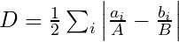
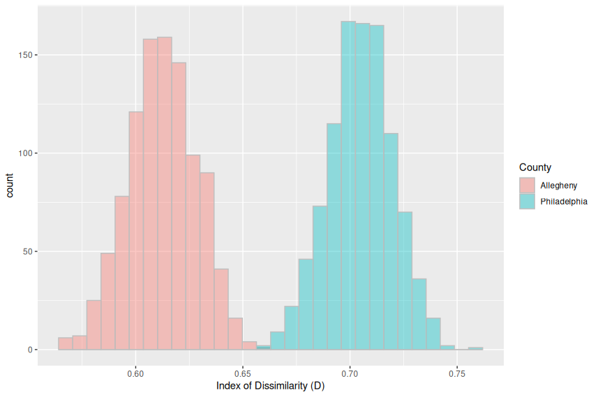
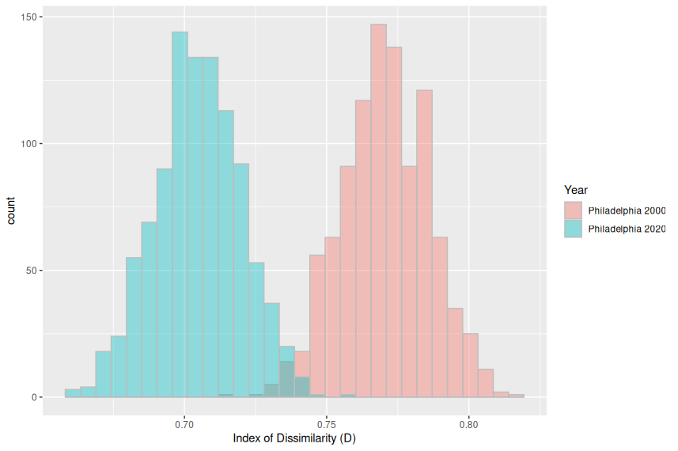
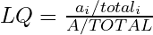
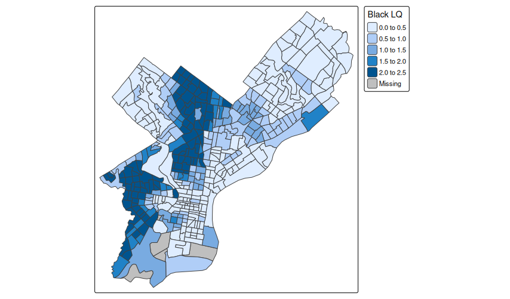
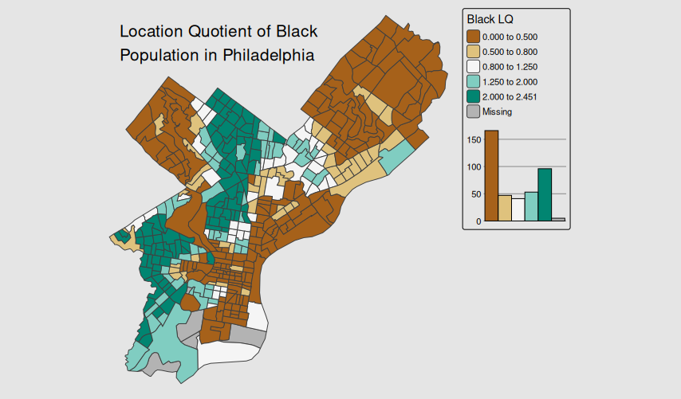

# Segregation Analysis with R

This exercise introduces segregation analysis using the **OasisR** package in R.

You will analyize segregation for counties in your state. This will include comparing two high population counties, and comparing one of those counties to an earlier point in time. Begin by identifying the most populous counties in your state. Then pick the largest county, and one other interesting comparison county. I will use Pennsylvania counties in the example. The 2020 populations by race of the six largest counties in Pennsylvania are:

| geoid | name         | total   | white  | black  | aian | asian  | hipi | other | two_or_more | hispanic |
|-------|--------------|---------|--------|--------|------|--------|------|-------|-------------|----------|
| 42101 | Philadelphia | 1603797 | 550828 | 613835 | 2596 | 132408 | 579  | 11419 | 53855       | 238277   |
| 42003 | Allegheny    | 1250578 | 938252 | 161554 | 1305 | 58318  | 304  | 6064  | 50456       | 34325    |
| 42091 | Montgomery   | 856553  | 618244 | 79510  | 763  | 67761  | 168  | 3863  | 31732       | 54512    |
| 42017 | Bucks        | 646538  | 521575 | 25277  | 531  | 35053  | 143  | 2512  | 21677       | 39770    |
| 42045 | Delaware     | 576830  | 363249 | 127055 | 676  | 36317  | 133  | 2596  | 20032       | 26772    |
| 42071 | Lancaster    | 552984  | 440613 | 19536  | 522  | 13939  | 110  | 1922  | 15171       | 61171    |

For this example, I will use Philadelphia and Allegheny County, which includes Pittsburgh. Another option would be to use Philadelphia and Montgomery, which would compare a central city with a suburban county in the the same metropolitan area.

The top two races by population in these counties are White and Black, so I will analyze White-Black segregation in this example. Bucks county has a high Asian and Hispanic population, so those would also be reasonable choices for comparison with either the White or Black population. Look at the top populations by race for your two counties, and pick two races that have a significant presence in both counties.

## Preparation

This exercise requires the use of the **OasisR** package for segregation analysis. Install it using `install.packages("OasisR")`. Remember that it only needs to be installed once, so don't submit this line as part of your script.

Other than **OasisR**, I do not tell you which packages to load in the exercise below. You should be familiar with all of them from the previous exercises. As usual, load all packages at the top of your script, even if you don't use a specific package until later in the exercise.

Begin by using `get_decennial()` to download the 2020 tract data by race for your two counties. As this has been demonstrated previously, it is not shown here. You do *not* need to download geometries at this time, although you will need them later. Make sure to download the data in **wide** format.

You can either download tracts for the two counties separately, or download all tracts for the state and then filter to get the counties you are analyzing. Either way, you should end up with two data frames, one for each county.

Also, as discussed previously, make sure to exclude special land use areas (Tract ID = 9xxx). I have a data frame named `philly_race_2020`. I removed special land use areas with:

```R
philly_race_2020 = philly_race_2020 |>
  filter(str_sub(geoid, 6, 6) != "9")
```

For this code to work, you need to also have a column named `geoid`. I renamed it from `GEOID` (capitalized as originally downloaded). You may have it capitalized, or you may have renamed it to something else.

After downloading data for Philadelphia and Allegheny counties, I have two data frames. The first few rows of the data frame for Philadelphia looks like this:

```
# A tibble: 6 × 13
  geoid       tract             county    state total white black  aian asian  hipi other two_or_more hispanic
  <chr>       <chr>             <chr>     <chr> <dbl> <dbl> <dbl> <dbl> <dbl> <dbl> <dbl>       <dbl>    <dbl>
1 42101000401 Census Tract 4.01 Philadel… Penn…  3123  1754   249     5   796     0    14         138      167
2 42101000102 Census Tract 1.02 Philadel… Penn…  3511  2719   132     6   286     1    25         134      208
3 42101000200 Census Tract 2    Philadel… Penn…  3367   784   251     7  2068     0    15         117      125
4 42101000300 Census Tract 3    Philadel… Penn…  4501  3100   300     0   641     3    14         164      279
5 42101000403 Census Tract 4.03 Philadel… Penn…  1139   787    78     1   169     0     0          37       67
6 42101000404 Census Tract 4.04 Philadel… Penn…  3822  2988   119     4   432     0    11         107      161
```

## Calculating the Index of Dissimilarity

We will calculate the Index of Dissimarity ($D$) for Philadelphia and Allegheny. $D$ is a measure of segregation between two groups, $A$ and $B$, calculated as follows:

$$D = \frac{1}{2} \sum_i \left|\frac{a_i}{A} - \frac{b_i}{B} \right|$$

<!---->

where $A_i$ and $B_i$ represent the populations for groups $A$ and $B$ in tract $i$, and $A$ and $B$ represent the group populations in the entire region.

**OasisR** makes it incredibly easy to calculate $D$ using the `DIDuncan()` function. `DIDuncan()` accepts a data frame *with only two columns*. Those two columns contain the populations for the two groups that you want to calculate the segregation between. We select the two columns of interest (I will use `white` and `black`), and pass that data frame to `DIDuncan()`.

```R
# View Index of Dissimilarity for Philly
philly_race_2020 |>
  select(white, black) |>
  DIDuncan()
```

```
       [,1]   [,2]
[1,] 0.0000 0.7047
[2,] 0.7047 0.0000
```

```R
# View Index of Dissimilarity for Allegheny
allegheny_race_2020 |>
  select(white, black) |>
  DIDuncan()
```

```
       [,1]   [,2]
[1,] 0.0000 0.6139
[2,] 0.6139 0.0000
```

> **NOTE:** My data frames do not have geometries. If you requested geometries with your download, this code will fail, because `select()` called on a spatial data frame will retain the geometries, and then the data frame that you pipe to `DIDuncan()` will have three columsn: the two race groups and the geometry column. In this case, use `st_drop_geometry() |>` to drop the geometries before piping to `DIDuncan()`.

The result is a matrix showing the segregation between Group 1 and itself; Group 1 and Group 2; Group 2 and Group 1; and between Group 2 and itself. For $D$, segregation between a group and itself is always zero, and segregation between two groups is **symmetric**, which is why the value in the upper right cell matches the value in the lower left cell. *For other indices of segregation, either of these things might not be true.* Some indices allow a group to be segregated from itself, or allow segregation between groups to be non-symmetric.

> **NOTE:** As discussed in class, $D$ can *only* calculate segregation between two groups. Calculating multigroup segregation requires other indices, such as MultiGroup Dissimilarity ($D*$), which is implemented in OasisR as `DMulti()`.

## Statistical Inference on the Index of Dissimilarity

As we can see, Black-White segregation ($D_{BW}$) for Philly is 0.7047, and for Allegheny it is 0.6139. Obviously, these numbers are different, but is the difference statistically significant? `OasisR` allows us to use **bootstrapping** to create hypothetical alternative distributions of the population. We can then use standard statistical tests, such as the $t$-test of difference of means, to compare these distributions.

We will use the `ResampleTest()` function to create the distributions for each county using the bootstrap method (`simtype = "Boot"`) with the number of simulations (`nsim`) set to 1,000. Remember that **OasisR** can calculate many different segregation measures. We tell `ResampleTest()` which measure we want to simulate by passing the function name as a string, which in this case is `"DIDuncan"`. Other segregation functions can be used as well.

```R
# Use bootstrap resampling to create distributions
nsim = 1000
resample_philly_2020 = philly_race_2020 |>
  st_drop_geometry() |>
  select(white, black) |>
  ResampleTest("DIDuncan", simtype = "Boot", nsim = nsim)

resample_allegheny = allegheny_race_2020 |>
  select(white, black) |>
  ResampleTest("DIDuncan", simtype = "Boot", nsim = nsim)
```

The resampling procedure produces a set of "possible" values for $D$. These can be stored in the `IndexDist` slot of the resulting object. We view the first few values here:

```R
head(resample_philly_2020$IndexDist[1,])
```

```
[1] 0.6948 0.7205 0.6978 0.7092 0.7181 0.7018
```

```R
head(resample_allegheny_2020$IndexDist[1,])
```

```
[1] 0.6020 0.5857 0.5974 0.6492 0.6361 0.6208
```

A $t$-test is a common statistical method to compare distributions to see if their means differ, usually within a 95% confidence level. That is, we are asking if the *mean* $D$ of the resampled distribution for Philadelphia is 95% likely to be different from the *mean* $D$ of the resampled distribution for Allegheny.

```R
d_philly_2020 = resample_philly_2020$IndexDist[1,]
d_allegheny_2020 = resample_allegheny_2020$IndexDist[1,]

t.test(d_philly_2020, d_allegheny_2020)
```

```
	Welch Two Sample t-test

data:  d_philly_2020 and d_allegheny_2020
t = 132.78, df = 1992.7, p-value < 2.2e-16
alternative hypothesis: true difference in means is not equal to 0
95 percent confidence interval:
 0.09101337 0.09374223
sample estimates:
mean of x mean of y 
0.7048944 0.6125166 
```

The important parts of this are:

* The difference in means is 95% likely to be between 0.091 and 0.094 (rounded).
* The *p*-value is 2.2 &times; 10<sup>-16</sup>. This indicates a very, very small probability that there is no true difference between the means of the distributions. Another way of saying this is that it is highly, highly *unlikely* that segregation in Philadelphia and Allegheny is actually *the same*.

We can compare the distributions visually using histograms. First, we construct a data frame to hold *both* distributions. Since the distributions have *only* the simulated $D$ values, we also have to assign names to each value. This is so that we can keep Philadelphia and Allegheny separate in the histograms.

```R
d_compare = tibble(
  County = c(rep("Philadelphia", length(d_philly_2020)), rep("Allegheny", length(d_allegheny_2020))),
  `Index of Dissimilarity (D)` = c(d_philly_2020, d_allegheny_2020)
)
```

This constructs a data frame with two columns: `County`, which has the names of the counties, which will show up in the plot legend, and `Index of Dissimilarity (D)`. Make sure to replace the names with the names of the two counties you are analyzing.

Then create the histogram with this code:

```R
ggplot(d_compare, aes(x = `Index of Dissimilarity (D)`, fill = County)) +
  geom_histogram(color = "grey", alpha = 0.4, position = "identity")
```

Some important parts of this code are:

* `fill = County` tells `ggplot` to plot the data in two groups that are colored based on the county. Note that we can pass in specific colors that we want to use, but in this case we are just using default colors.
* `color = "grey"` sets the *outline* color of the histogram bars.
* `alpha = 0.4` sets the transparency to 40%, so that the histograms can overlap each other without the "top" histogram blocking the "bottom" histogram.
* `position = "identity"` allows the histogram to overlap. The default is `"stacked"`, which would show the bars above each other (that is, make them taller) rather than overlapping each other.



## Changing Segregation Over Time

We can do the same thing to compare changing segregation over time. Download race data for 2000 for one of the counties you are analyzing. Again, I leave it to you to construct the `get_decennial()` call, but here are some hints:

* The summary file prior to 2020 was SF1 (`sumfile = "sf1"`), not DHC.
* The relevant table is P8 in 2000. Variable names have the same column number, but the template for the variable name is different. For example:
    * Total population is `"P5_001N"` in 2020 and `"P008001"` in 2000.
    * Non-Hispanic White population is `P5_003N` in 2020 and `"P008003"` in 2000.
    * Etc. Notice that the final three digits are the same in each case (i.e. `001` for total population in both 2020 and 2000).
* The 2000 data does not use the convention of assigning Census tracts IDs in the 9000s for special land use areas. Filter your data to remove tracts with low or no population (e.g. remove 0 population tracts, or tracts with population below 10).

Once you have the data, you should use resampling to create a distribution of values for $D$ in the year 2000, then run a $t$-test to compare with $D$ in 2020, then create an overlapping histogram. Refer to the code above where you compared two counties. Comparing the same county at two points in time will work the same way. The histogram and the $t$-test indicate that White-Black segregation in Philadelphia has significantly declined over the past 20 years.



## Visualizing Local Segregation

$D$ and many other such indices are measures of *global* segregation. That is, they quantify how segregated groups are from each other across a region, such as a county or metropolitan area.

Often we are interested in quantifying and visualization *local* segregation. That is, for a small area *within* the region, such as a Census tract, we want to see how segregated the local population is *in that area*. One way to do this is with a measure that shows how atypical the population is within the context of the larger region.

One such measure is the **location quotient**. We have already discussed the location quotient in the context of business datasets. It is frequently used as a measure of industrial concentration for a region, where it can tell us how concentrated a sector or industry is in comparison with the economy as a whole. Location quotients are also used in segregation research to show how concentrated a demographic subgroup is in comparison with their representation in the total population.

The location quotient is calculated as a ratio of ratios:

$$LQ = \frac{a_i/total_i}{A/TOTAL}$$

<!---->

where $a_i$ and $A$ represent tract and regional populations of group $A$, and $total_i$ and $TOTAL$ represent the total population of the tract and region.

We want to map the results, so begin by redownloading race data *with geometries* for 2020 for the largest county in your state. You can also reuse the data frame that you created for Exercise 3b: Map-Making with Tmap v4.

Then use the `mutate()` function to add the location quotient to the data frame. Use one of the three largest race groups for your county. For Philadelphia, I calculated the location quotient for the Black population (the largest group in Philadelphia) as follows:

```R
# zz_philly_race previously downloaded for tmap exercise
philly_race_lq = zz_philly_race |>
  mutate(`Black LQ` = (Black / Total) / (sum(Black) / sum(Total)))
```

I'm using the somewhat unwieldy column name `"Black LQ"`, because the column name will appear in the legend. It saves me from having to customize the column name in the legend if I used an easier (for coding) column name like `black_lq`.

We can create a basic map with default settings very easily:

```R
tm_shape(philly_race_lq) +
  tm_polygons(fill = "Black LQ")
```



This map can be improved in one major way. Location quotients have a central value of 1, which means that a group's proportion in a Census tract is equal to their proportion in the region. LQ values greater than 1 mean the group is *concentrated* or *overrepresented* in that tract, and values less than 1 mean the group is *underrepresented* in that tract. We would like to visually emphasize divergence from this central value. That is exactly what **diverging** color palettes are for. In the code below I use the ColorBrewer Brown-BlueGreen palette (`values = "brewer.br_bg"`).

Note, however, that the middle class in the legend above is "1.0 to 1.5". We would like this middle class to go from slightly below 1 to slightly above 1. The location quotient's minimum value is 0, but it's maximum value is infinity. We don't really want the middle class to run from 0.5 to 1.5, because 0.5 is in some sense *farther away* from 1.0 than 1.5 is. This is because 0.5 represents *half* the "expected" ratio. On the other side of scale, we really want the value that represents *twice* the expected ratio, which is 2.0.

Therefore in the following code I will use **fixed** class breaks, and explicitly define them so that the breaks below 1 are balanced against their inverse above one, e.g. 0.5 and 2.0.

I have used an upper value of 2.5, since that was what appeared in the default map above. You should make sure to use a value that is higher than maximum in your data, but not so high as to be misleading. (That is, don't just stick in 100.) You can also use the `max()` function to derive the actual highest value from your location quotient column. For my data, this would look like ``max(philly_race_lq$`Black LQ`, na.rm = TRUE)``.

The rest of the code mimics what you have already seen in the tmap exercise.

```R

tm_shape(philly_race_lq) +
  tm_polygons(fill = "Black LQ",
              fill.scale = tm_scale_intervals(
                n = 5, style = "fixed", 
                breaks = c(0, 0.5, 0.8, 1.25, 2, 2.5),
                values = "brewer.br_bg", value.na = "grey70"),
              fill.chart = tm_chart_histogram()
  ) + 
  tm_layout(frame = FALSE,
            bg.color = "grey90") +
  tm_title_in("Location Quotient of Black \nPopulation in Philadelphia")
```



The histogram in the legend is actually very useful in helping us understand segregation in Philadelphia. Notice that the histogram is **bimodal**. It has a gap in the center, and spikes at the outer edges. This indicates that Black residents of Philadelphia rarely live in tracts that roughly match their proportion of the entire city population (38%). They tend to live in tracts where they are *overrepresented*. The histogram shows that there are almost 100 tracts (out of 408) that are over 76% Black (twice 38%).

This necessarily means that there are a large number of tracts where Blacks are *underrepresented*. There are over 150 tracts that are under 19% Black (half of 38%).

## DELIVERABLES

You will submit your R script and a brief report with three figures as demoed in the exercise above: Two histograms and one map. The map should use a diverging color scheme with fixed breaks.

Submit the following:

* Your R script, in which you calculate the Index of Dissimilarity for two counties in your state in 2020, and one of the counties in 2000.
* A PDF with three figures and the following info in narrative form:
    * Your state
    * The two counties and two race groups you chose and their 2020 populations
    * A discussion of why you chose these counties and groups; e.g. Are you comparing a suburban county and a central city, two central cities, or something else? Are you comparing a majority race and a large minority, or two large minorities? Is one of the counties "majority minority", like Philadelphia is?
    * The Index of Dissimilarity you calculated for both counties, the histogram of the resampled distributions, and whether a $t$-test indicates that segregation is significantly different between the two counties.
    * The Index of Dissimilarity you calculated for the year 2000, the histogram of the resampled distributions, and whether a $t$-test indicates that segregation has significantly changed (increased or decreased) between 2000 and 2020.
    * The map of the location quotient for one of the large racial groups in your main county.


